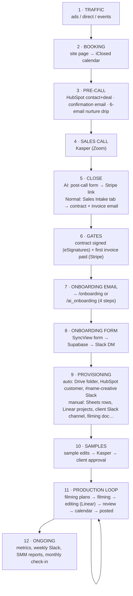
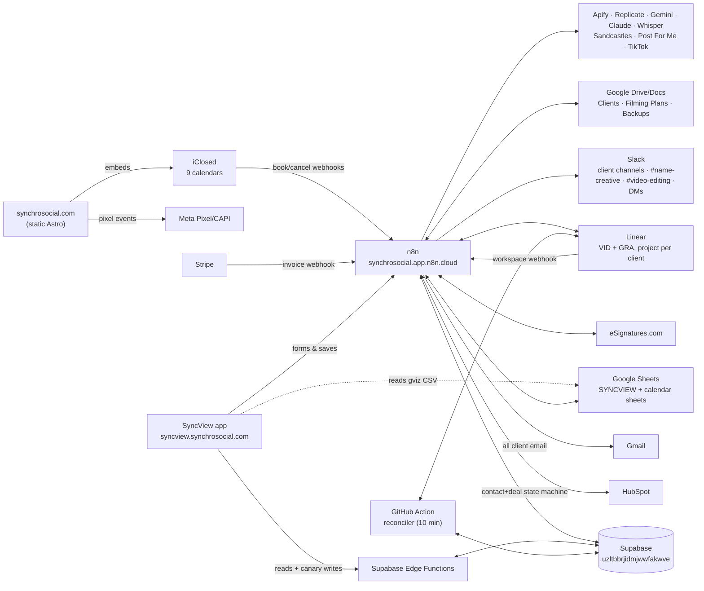

# Synchro Social — Client Lifecycle Map

> **🔁 MIRRORED DOC — lives in BOTH repos.** Identical copies exist at
> `synchrosocial/docs/CLIENT_LIFECYCLE_MAP.md` and
> `client-analytics/docs/CLIENT_LIFECYCLE_MAP.md`. **If you change one, apply
> the identical change to the other in the same session/PR.** Keep the two
> files byte-identical.
>
> **CUTOVER SAFETY NOTICE (2026-07-14): this copy is stale and non-operative for Track A/Track B.**
> The sections that still describe per-client Track-A canaries, empty Track-B tables, an active n8n
> Linear receiver, ten-minute-only healing, or n8n-primary app writes are historical. Current truth:
> Track A is full-roster; the Track-B mirror is populated; the Production caller is live but
> authority-locked; `linear-inbound` is the real-time EF lane; the legacy combined n8n receiver is
> inactive/unpublished; and the pager participates in reconciler cadence. Do not plan, flip, restore,
> or retire from this file. Use the current `client-analytics` System Map, cutover register, GO LIVE,
> FLIP, and ROLLBACK until a complete byte-identical update lands in both repositories (F71).
>
> **The master map.** Every traffic source → page → calendar → automation →
> human step → data store, from a stranger clicking an ad to a live client
> getting weekly content. Mapped **2026-07-10** from the live n8n instance
> (92 workflows), the `synchrosocial` and `client-analytics` repos, Linear,
> and the design docs. Companion docs:
>
> | Doc | Covers |
> | --- | --- |
> | `synchrosocial` repo — `docs/ECOSYSTEM_MAP.md` | The booking layer in detail — pages ↔ iClosed calendars |
> | `synchrosocial` repo — `docs/meta-ads/README.md` | Tracking: pixel, CAPI, event map, Meta campaign memory |
> | `client-analytics` repo — `NEW_CLIENT_ONBOARDING.md` | The manual per-client setup runbook (step-by-step) |
> | `client-analytics` repo — `TRACK_A_…` / `TRACK_B_…` specs | In-flight migrations (n8n→Edge Functions, Linear replacement) |
>
> ⚠️ **This map has a shelf life.** Linear is being replaced (Track B), Sheets
> are being migrated to Supabase, and the repo is being reorganized. §14 lists
> what's in flight; when one of those lands, update the affected section and
> the date above.

---

## 0. The lifecycle at a glance



Two parallel funnels run through the whole pipeline — **Normal** (main
social-media service, purple) and **AI** (AI-clone service, coral). They are
distinguished by: the iClosed calendar booked (top), the HubSpot contact
property `is_ai_client` (middle), and the `funnel` field / Supabase table
(`client_onboarding` vs `ai_client_onboarding`) at onboarding.

---

## 1. Stage 1 — Traffic & booking (the website)

Detailed page↔calendar mapping lives in `docs/ECOSYSTEM_MAP.md`. Summary:

| Entry | Page path | Calendar (iClosed slug) | Qualifies? | After booking |
| --- | --- | --- | --- | --- |
| Cold ads (current Meta plan) | `/` or `/apply` | `social-media-consultation` | YES | redirect → `/thank-you` |
| Cold ads (AI VSL path, kept) | `/ai` → `/call` | `ai-intro-call` | YES | internal confirm |
| Events hub QR | `/event` → book | `demo` | no | internal |
| AI invite — clients | `/ai-invite/schedule-clients` | `demo` | no | internal |
| AI invite — investors | `/ai-invite/schedule-investors` | `1-1-call-with-kasper` | no | internal |
| Legacy homepage | `/old` | `demo` | no | internal |
| Onboarding step 3 (normal) | `/onboarding_step3` | `kickoff-call` (60 min) | no | internal → step 4 |
| Onboarding step 3 (AI) | `/ai_onboarding_step3` | `ai-clone-consultation` | no | internal → step 4 |
| Monthly check-in email | (email link, no page) | `check-in` | no | — |

All calendars are `https://app.iclosed.io/e/synchrosocial/<slug>`, host
kasper@synchrosocial.com. **Nine calendars exist in practice** — the eight
above plus the floating **iClosed LIFT widget** (id `Pk9Vea_CtsCr`) shown on
`/`, `/apply`, `/thank-you`, whose target calendar is set in the iClosed
dashboard (not in code — worth confirming which calendar it books).
The `check-in` calendar is used only by the *Clients — Monthly Check-in*
automation (§10) and appears on no page and no other map.

**Tracking** (detail in `docs/meta-ads/README.md`): Meta Pixel
`4309835332571875` on every page; `ViewContent` on `/apply` and `/call`;
custom `iclosed_potential/qualified/disqualified` from the embed bridge; and
`Schedule` + `Lead` on `iclosed.call_scheduled` (deduped with `/thank-you`
fallback via a stored event id). ⚠️ Because the bridge lives in
`IClosedEmbed.astro`, **booking the onboarding kickoff calendars also fires
`Schedule`+`Lead`** — post-sale clients trip the acquisition conversion
events (see §15.1).

---

## 2. Stage 2 — Call booked (automation kicks in)

iClosed fires its **"Call booked" webhook** →
`POST synchrosocial.app.n8n.cloud/webhook/iclosed-call-booked` →
n8n **Sales — Call Booked (iClosed)** routes on the event slug:

| Event slug | Route |
| --- | --- |
| `ai-intro-call` | AI branch (inline in the router) |
| `social-media-consultation` | sub-workflow **Normal Sales — Booking Handler** |
| anything else (`demo`, `1-1-call-with-kasper`, `kickoff-call`, …) | **ignored** — no CRM record, no email (§15.12) |

Both branches do the same dance:

1. **HubSpot**: search contact by email. New lead → create contact
   (AI branch also sets `is_ai_client=true`), create **deal** in the default
   pipeline at stage `appointmentscheduled`, save `deal_id` on the contact.
   Returning lead → no new deal, short re-confirmation email only.
2. **Confirmation email** (Gmail, "Synchro Social"): normal =
   "You're booked, {first_name}" (accept-the-invite + 1B-views pitch);
   AI = "You're booked, {first_name}. Here's what happens next."
3. **Pre-call nurture drip** (new leads only) — sub-workflows
   **Normal Sales — Pre-Call Nurture** / **AI Sales — Pre-Call Nurture**:
   wait 1 h, then send **6 emails** spaced evenly across the remaining time
   to the call (interval = time-to-call ÷ 7, minimum 30 min). Before every
   send it checks the n8n Data Table **`iClosed Cancelled Calls`** and stops
   silently if the booking was cancelled.

   | # | Normal funnel subject | AI funnel subject |
   | --- | --- | --- |
   | 1 | The engine behind 1,000,000,000 views | You wake up, {first}, and your content is already done. |
   | 2 | "Do I have to be on camera?" — and 4 more questions everyone asks | Bad AI avatar vs. good AI avatar |
   | 3 | How fast this works — real numbers, no hype | {first}, will your audience know it's AI? 🤔 |
   | 4 | Why most content teams fail personal brands | Why most content teams fail personal brands |
   | 5 | What content production actually costs in 2026 | What content production actually costs in 2026 |
   | 6 | {first}, your first 90 days, step by step | {first}, your first month with us, step by step |

**Cancellations**: iClosed "Call cancelled" webhook →
`/webhook/iclosed-call-cancelled` → **AI Sales — Call Cancelled (iClosed)**
writes a row into `iClosed Cancelled Calls`. Despite the "AI" name it's the
kill-switch for **both** funnels' nurtures. It does **not** touch the HubSpot
deal — a cancelled call's deal stays at `appointmentscheduled` (§15.13).

---

## 3. Stage 3 — The sales call & the close

Kasper takes the call (Zoom, from the iClosed booking). What happens after
differs by funnel — this asymmetry is by design but easy to forget:

**AI funnel — Post-Call Next Steps** (n8n form at
`…/form/post-call-actions`, internal): Kasper enters the client email +
picks Monthly/Quarterly → workflow verifies the contact has
`is_ai_client=true` → sends "Next Steps - Let's Get Started!" email with the
Stripe payment link (monthly `buy.stripe.com/3cI00i31Qa4n…` / quarterly
`buy.stripe.com/dRm4gyfOC7Wf…`) and promises the agreement email → moves the
deal to `presentationscheduled`. **Non-AI clients silently no-op** in this
form.

**Normal funnel — Sales Intake tab** (SyncView, Kasper-gated via
`?Kasper=1`): Kasper fills a 12-field form (client name/email/Instagram,
closed-by, contract start date, deliverables, billing type, amount, payment
link, termination clause, referred-by) → `POST /webhook/sales-intake-submit`
→ n8n **Sales Intake — Submit**:

- Validates hard pricing rules: monthly = **$2,997** with Stripe link
  `buy.stripe.com/00waEW0TI6Sb…`, quarterly = **$7,991** with
  `buy.stripe.com/28E00i6e2ekD…`; custom/one-time must NOT reuse those links.
- Inserts an audit row into Supabase **`sales_intakes`** (status lifecycle
  `submitted → contract_created → email_sent`, plus `preview_*` and failure
  states).
- Creates the **eSignatures.com** "Sales and Service Agreement" from
  template `be936623-…` with the form's placeholder fields.
- Sends ONE combined client email — subject *"{first}, your Synchro Social
  agreement + first invoice"* — with the signing link and the Stripe link.
- Slack-DMs Sidney a confirmation (or a 🚨 alert with manual-recovery links
  on eSign/email failure).
- Supports `preview_contract` (create + return signing URL, no email) and
  `send_existing_contract` (send a previously previewed contract).

> **Current blocker (F106/F107):** “Kasper-gated” describes only the visible per-tab UI unlock.
> The active webhook authenticates no caller. It also acknowledges both send branches before the
> email result, trusts browser-round-tripped preview identifiers/link state, and has no durable
> request idempotency key. Require an active individual Kasper/Admin principal plus a server-owned
> receipt/state machine, or deactivate this route and use the manual process.

`SALES_INTAKE_DESIGN.md` is the reconciled deployed-state contract. F106/F107 and the downstream
F115/F116 gates must all close before this funnel is operationally trusted.

---

## 4. Stage 4 — Contract + payment gates → onboarding email

Two independent provider callbacks set HubSpot contact properties and attempt to trigger the
onboarding email. The intended rule is “exactly once after both verified gates,” but current graphs
do not safely implement it:

| Property | Set by | Meaning |
| --- | --- | --- |
| `is_ai_client` | booking router | funnel routing key for everything downstream |
| `deal_id` | booking router | link to the deal |
| `contract_signed` | Sales — Contract Signed | eSignatures done (idempotency guard) |
| `first_invoice_paid` | Sales — Invoice Paid (Stripe) | first Stripe invoice done (only the first payment matters) |
| `onboarding_sent` | onboarding-email workflows | prevents double-send |

- **Sales — Contract Signed** (`/webhook/contract-signed`): deal → `closedwon`,
  `contract_signed=true`. It compares a static caller-body token, not the provider's native
  raw-body HMAC, and does not correlate the event to the agreement created for this sale. If
  `first_invoice_paid` already true and `onboarding_sent` empty → route by
  `is_ai_client` → send onboarding email.
- **Sales — Invoice Paid (Stripe)** (`/webhook/stripe-invoice`): deal →
  custom stage `3230372548` ("invoice paid"), `first_invoice_paid=true`. The unauthenticated route
  does not verify the provider signature/raw body, event identity/type/mode/account/paid state, or
  correlate the payment to server-owned sale state. Mirror-image gate check → onboarding email.
- Missing HubSpot contact on either webhook → ⚠️ Slack DM to Sidney to
  handle manually.

> **Current blockers (F115/F116):** both routes acknowledge on receipt and trust unverified caller
> events. Each then decides from the contact snapshot read **before** its own flag write. A
> simultaneous valid pair can leave both flags true while neither sends; duplicates can make more
> than one asynchronous child pass the old `onboarding_sent` check. The children have no durable
> unique gate job, joined completion receipt, error workflow, or reconciler. Provider-native
> verification/correlation plus one atomic idempotent gate and resumable email job are mandatory.

**Onboarding email** (Normal Client / AI Client — Send Onboarding Email):
subject *"Synchro Social X {first_name} — doesn't that sound magnetic?"*,
CTA → `synchrosocial.com/onboarding` (normal) or
`synchrosocial.com/ai_onboarding` (AI). Sets `onboarding_sent=true` and
moves the deal to… stage value **`closedlost`**, repurposed to mean
"onboarding sent" (§15.2 — reads as *Closed Lost* in a default pipeline).

**HubSpot deal-stage lifecycle as actually used:**
`appointmentscheduled` → (`presentationscheduled`, AI only) → `closedwon`
(contract) / `3230372548` (invoice) → `closedlost` (⚠ = onboarding sent) →
`decisionmakerboughtin` (= onboarded, set by provisioning §6).

---

## 5. Stage 5 — Client-side onboarding (site + form + kickoff call)

**Website steps** (static pages, this repo; shared shell
`OnboardingStep.astro`; no data collected on-site):

| Step | Normal (`/onboarding…`, purple) | AI (`/ai_onboarding…`, coral) |
| --- | --- | --- |
| 1 — What To Expect | Wistia video | same video |
| 2 — Complete This Form | button → `syncview.synchrosocial.com/?onboarding=1` | button → `…/?onboarding=ai` |
| 3 — Strategy Session | embeds `kickoff-call` (60 min) | embeds `ai-clone-consultation` |
| 4 — Final Words | wrap-up video, end | wrap-up video, end |

**The onboarding form** lives in SyncView (`client-analytics` repo,
`ONBOARDING_FORM.md`) at clean paths `/onboarding_form` /
`/ai_onboarding_form`. Chrome-free, no staff password, autosaves drafts to
localStorage. Sections: basic info → brand & audience → style
(video/thumbnail prefs) → **sample video** (normal funnel only — the ~30 s
clip that seeds the samples stage) → photos & source material → goals →
account access (credentials). AI variant swaps sample-video for an
**AI avatar** section (personality, setting, framing, voice, likeness).

**Submit pipeline** (never-lose-a-submission design, `ONBOARDING_FALLBACK.md`):

```
form ──POST──▶ n8n /webhook/onboarding-submit        (normal)
              n8n /webhook/ai-onboarding-submit      (AI)
                │  insert → Supabase client_onboarding / ai_client_onboarding
                │  (insert failure → dead-letter Data Table + 🚨 DM)
                ├─ Slack DM Sidney ("🎉 / 🤖 new onboarding submitted")
                ├─ best-effort POST → Supabase EF client-credentials
                │    (action onboarding_import — seeds the credentials vault)
                └─ Execute Workflow ──▶ Client — Onboarding Provisioning (§6)
   on failure ─▶ Supabase EF onboarding-capture  AND
                n8n /webhook/onboarding-fallback → Data Table onboarding_fallback → 🛟 DM
```

**Current acknowledgement boundary (F110):** the primary graphs respond after the intake-row
insert/fail-soft alert, then start provisioning without waiting; credential import is a separate
fail-soft branch. A duplicate row responds directly and runs neither. The form clears its draft/id
and says Thank You on any 2xx, including capture-only fallback. Therefore this diagram shows
attempted side effects, not a transaction: **captured ≠ provisioned** until a durable resumable job
reads every step back as complete. The canonical staff handoff is the SyncView inbox/job, not the
replaced Notion trigger (F111).

A third, read-only funnel exists: **`legacy_onboarding`** — 21 old Notion
form submissions imported into Supabase, credentials split into a
service-role-only column. Staff read all three funnels via Edge Functions
(`onboarding-list`, `ai-onboarding-list`, `legacy-onboarding-list`,
credential-stripped; `onboarding-full` = Kasper-only, keyed, un-stripped).

---

## 6. Stage 6a — Automated provisioning

n8n **Client — Onboarding Provisioning** (called by both submit workflows
with `funnel = standard | ai`):

This dispatch is currently unawaited and has no durable job/step ledger, completion callback, or
whole-run reconciliation. Each item below is an intended side effect, not a completion guarantee.

1. **Google Drive**: create folder `{first}-{last}` inside the shared
   **Clients** folder (`17u2c8JMLkrKMRxAXczirMFitNv1wD-JA`).
2. **HubSpot**: contact lifecycle → `customer`; deal →
   `decisionmakerboughtin` ("onboarded").
3. **Slack**: create public channel **`#{first-last}-creative`**, invite
   Sidney + Kasper, post a kickoff message (team/resource/timeline
   placeholders for Kasper to fill) and the **full form-answer brief**
   (credentials excluded — those live only in Supabase). If channel creation
   fails, the whole brief falls back to a DM to Sidney.

---

## 7. Stage 6b — Manual setup (where a new client must exist)

The runbook is `client-analytics/NEW_CLIENT_ONBOARDING.md`. This table is
the checklist of **every place a client exists**, and whether creation is
automated today:

| # | System | What gets created | How |
| --- | --- | --- | --- |
| 1 | HubSpot | contact + deal + lifecycle | ✅ auto (booking → gates → provisioning) |
| 2 | Supabase `client_onboarding` / `ai_client_onboarding` | form submission | ✅ auto (form submit) |
| 3 | Supabase `client_credentials` | login vault rows (`needs_review`) | ⚠️ fail-soft attempt; no joined receipt/resume (F110) |
| 4 | Google Drive "Clients" folder | client folder | ⚠️ unawaited provisioning attempt; no completion receipt (F110) |
| 5 | Slack `#name-creative` | internal creative channel + brief | ⚠️ unawaited provisioning attempt; no completion receipt (F110) |
| 6 | Slack **client channel** | the channel the client is in (weekly reports, tweak pings) | ❌ manual — note the ID `C…` |
| 7 | SYNCVIEW sheet → `Clients Info` | the **public, non-secret** row that puts the client live in SyncView (allowlist is sheet-driven): name, handles, competitors, keywords, `slack_channel_id`, `postforme_account_id` | ❌ manual |
| 7a | Supabase `client_access` + authenticated link builder | service-role-only review token and the staff-authorized path that copies one exact client's link; **never put the token in Clients Info** (audit F33) | ❌ Track-B onboarding/distribution gap |
| 8 | SYNCVIEW sheet → `Social Media Managers` | client → SMM assignment (+ per-SMM Linear key, Slack id) | ❌ manual |
| 9 | SYNCVIEW sheet → `Monthly Checkup` | opt-in row for monthly check-in emails | ❌ manual |
| 10 | Linear | **one project per client**, named exactly the client name, on Video (VID) + Graphics (GRA) teams (duplicate "Client Example"), SMM as lead, Slack channel linked, brand info in description | ❌ manual (→ replaced by Track B) |
| 11 | Google Drive "Client Filming Plans" | client folder + **master filming Doc** (one Docs tab per month) | ❌ manual (Kasper) |
| 12 | Supabase `filming_plans` | row linking the master Doc | ❌ manual (via Filming Plans tab, staff-key gated) |
| 13 | Content-calendar sheet (`1XOyGrvSo52e…`) | per-client tab (used by add-to-calendar automation) | ❌ manual |
| 14 | Sandcastles | client + competitor handles on the watchlist | ❌ manual |
| 15 | Post For Me | TikTok account (`spc_…`) for auto-upload | ❌ manual, optional |
| 16 | `SAMPLES_BY_CLIENT` map in **VIDEO PRODUCTION AUTOMATION** code node | reference thumbnails for the AI thumbnail pipeline | ❌ manual **code edit** (§15.7) |
| 17 | Supabase `calendar_posts` / `sample_reviews` | rows auto-create on first write (PK `(client, id)` by slug) | ✅ auto |

Once the `Clients Info` row exists the client appears in SyncView with no
deploy, and the scheduled robots (§10) pick them up automatically. Client
slug convention everywhere: lowercase, strip accents and leading "Dr.",
drop non-alphanumerics.

---

## 8. Stage 7 — Samples

The onboarding form's sample video (plus brand answers) seeds **sample
edits** — subtitle styles, thumbnail looks — approved before real content
starts. ⚠️ Two generations coexist (`client-analytics` docs, `SAMPLES_*`):

- **Content Samples** (gen 1, `content_samples` table): the staff nav/route is retired and the old
  client URL currently redirects unsafely into generic Sample Review (F117). The dormant strip had
  one status/thread and `?sv2` default-on reads; its active n8n writers fan out Sheet + Supabase but
  can continue after a Sheet failure, so `?sv2=0`/automatic Sheet fallback is not writable recovery
  (F57). Do not restore this generation without one exact-client and coupled-authority boundary.
- **Sample Review** (gen 2, `sample_reviews` + `sample_review_events`,
  **GA default ON** since 2026-07-02 with sticky `?sxr=0` opt-out): the calendar's
  architectural twin. Components video + thumbnail; statuses In Progress →
  For SMM Approval → Kasper Approval → Client Approval → Approved (+ Tweaks
  Needed interrupt); per-component comment threads; Linear VID/GRA
  sub-issue links; Kasper cross-client review sub-tab; client review portal
  via token link `?sxr=1&c=<name>&v=sample-reviews&t=<token>`; writes via
  EF `sample-review-upsert` (canary per client) or n8n fallback; audit
  ledger + 10-min Linear reconciler.

Client approves samples → approved look is recorded (Linear project
description holds "approved sample" links today) → production begins.

---

## 9. Stage 8 — The production loop

The recurring engine once a client is live:

1. **Filming plans** — Kasper writes one master Google Doc per client, one
   tab per month. Supabase `filming_plans` is the source of truth; the
   SyncView Filming Plans tab combines it with calendar runway
   (days of scheduled posts left) into 🟢/🟡/🔴 "who's running out of
   content" alerts (red ≤ 10 d). Doc tabs are read via n8n
   `filming-plan-tabs` (Google Docs API).
2. **Filming** — client films (or AI clone generates); footage lands in the
   client's Drive folder.
3. **Editing intake — VIDEO PRODUCTION AUTOMATION** (n8n, 6 webhooks): the
   `video-form` creates a Linear parent + one VID sub-issue per video and
   **auto-assigns the editor with the fewest open sub-issues**, then DMs the
   SMM. The `graphic-form` does the same for GRA and runs the **AI thumbnail
   pipeline** (filming-Doc titles via Claude → frame extraction via
   Replicate → best-frame pick via Gemini → composed thumbnail via Gemini →
   Drive upload → Linear comment).
4. **Review lifecycle** — editors/designers move Linear sub-issue states;
   two-way sync keeps SyncView cards in step (see below). SMM → Kasper →
   client approvals happen on the SyncView **content calendar** card
   (per-component statuses: video / graphic / caption / title). Kasper's
   "finish reviewing" state is global/cross-device. Clients review via
   token links; client tweaks land as comments. **Urgent tweaks** ping the
   assigned editor in Slack `#video-editing`. YouTube titles get their own
   review loop (title_status, no Linear). Thumbnail revisions are
   snapshotted for before/after evidence when tweaks are requested.
5. **Scheduling & posting** — approved cards get scheduled/posted on the
   calendar. The retained `add-to-calendar` branch is **not a safe ingestion contract** (F126): it
   accepts first-page-only children/comments as complete, can omit later work/links, writes the
   legacy client-facing Sheet, and acknowledges without completeness. Identify and retire its
   caller or rebuild it as a fully paged durable job. TikTok can auto-post via Post
   For Me or the first-party TikTok pilot. **Content-ready notify** emails
   the client ("Your content is ready for review! 🎉").

**Linear ⇄ SyncView sync** (until Track B lands): current real-time inbound is the
`linear-inbound` Edge Function; the combined n8n receiver with Calendar/Samples/Workload branches is
inactive/unpublished and must not be represented as serving production (F46). SyncView → Linear
uses legacy mutation routes until reroute; GitHub reconcilers heal Calendar/Samples drift, while
`workload_issues` remains a derived Linear cache. F29/F126 mean a green reader run is not a
completeness receipt.

---

## 10. Ongoing per-client automations (the robots)

| Automation (n8n) | Schedule | What it does |
| --- | --- | --- |
| CLIENTS METRICS | daily | IG (Apify) + TikTok (Apify) + YouTube stats per `Clients Info` row → appends `Metrics` / updates `PostTracking`. **F124:** source/prior-state failures can become ordinary zero/reset rows or stop later roster clients while the run succeeds; require per-client/platform coverage and last-good/degraded semantics. |
| TOP VIDEOS / COMPETITOR RESEARCH / MARKET RESEARCH | scheduled | research briefs per client → sheets → SyncView Analytics tab. **F124:** Top Videos can treat provider errors as empty/old complete truth; valid empty and source failure are not distinguished. |
| Weekly Slack – Top Reel | Mondays | posts each client's top reel into their client Slack channel |
| Clients — Monthly Check-in | 1st of month, 08:00 | emails every `Monthly Checkup` row a check-in with the iClosed **`check-in`** calendar link |
| SMM Reports — Weekly Reminder | Mondays 09:00 | emails Kasper the SMM weekly-reports viewer link |
| SMM Reports — Manager Sync | daily 06:00 | syncs `Social Media Managers` sheet → Supabase `social_media_managers` |
| Workload — Reconcile | every 10 min | rebuilds `workload_issues` from Linear |
| Calendar — Linear Reconcile Trigger | every 10 min | dispatches the GitHub Action reconciler |
| SyncView — Weekly Backup | Sundays 02:00 | dated Drive folder: Sheet copy, repo zip, workflow export, Supabase dumps. **F13:** continued errors/empty substitution mean a green run is not a complete restore set; D-1 independent manifest/readback/restore remains open. |
| Editors — Labor Week | on demand | per-editor delivery counts from Linear history |
| Error alert relays | event-driven | n8n errors + Supabase EF alerts → DM Sidney |

---

## 11. Systems & data stores (what lives where)

**Supabase** (project `uzltbbrjidmjwwfakwve`) — full table list in the
`client-analytics` migrations; by lifecycle area:

- Sales/onboarding: `sales_intakes`, `client_onboarding`,
  `ai_client_onboarding`, `legacy_onboarding`, `onboarding_fallback`
  (all RLS-locked, no anon reads).
- Credentials vault: `client_credentials` + `client_credential_events` +
  `client_credentials_rev` (EF-only, keyed, audited incl. reveals).
- Production: `calendar_posts` (+`calendar_post_events`), `content_samples`,
  `sample_reviews` (+`sample_review_events`), `filming_plans`,
  `workload_issues`, `thumbnail_media_revisions`, `smm_weekly_reports`,
  `templates`, `caption_prompts`, TikTok tables.
- Track B (mostly empty, awaiting go): `clients`, `team_members`,
  `batches`, `deliverables`, `deliverable_events`, `mirror_outbox`,
  `linear_archive`, `syncview_runtime_flags`.

**Google Sheets** (legacy layer, being migrated):

- **SYNCVIEW** (`10QQnWOQY73…`): `Clients Info` (⚠ still the live client
  allowlist), `Social Media Managers`, `Monthly Checkup`, `Video Editors`,
  `Metrics`, `TopVideos`, briefs tabs, `Linear Submissions`, `PostTracking`.
- **SyncView Calendar** (`1Gsn5xLImJy…`): legacy `Calendar_<slug>` /
  `Samples_<slug>` mirrors (no longer load-bearing).
- **Client-facing content calendar** (`1XOyGrvSo52e…`): one tab per client,
  written by `add-to-calendar`.
- **Project Central** (`1ZAGZBMoT1M…`): internal ops tracker. Its active unauthenticated API can
  accept partial/empty/stale state, clear all three live tabs before append, and leave an empty or
  partial hierarchy with no staging/revision/restore receipt (F123). Do not use it as a recovery tool.

**n8n Data Tables**: `iClosed Cancelled Calls` (nurture kill-switch),
`onboarding_fallback` (drafts / fallback / dead-letter).

**HubSpot**: contacts + deals, default pipeline; custom contact properties
`is_ai_client`, `deal_id`, `contract_signed`, `first_invoice_paid`,
`onboarding_sent` (§4). This is the sales-funnel state machine — nothing
else in the pipeline reads HubSpot.

**Linear** (workspace `synchro-social`, until Track B): teams **VID** +
**GRA** (+ Reporting, Podcast Episodes, Content Research, Executive
Assistant); one project per client named exactly the client name (the
universal join key); per-post VID/GRA sub-issues; states relied on by name:
Todo/In Progress/For SMM Approval/Kasper Approval/Client Approval/Approved/
Tweak(s) Needed/Scheduled/Posted.

**Slack**: per-client client channel + per-client `#name-creative`
channel (§15.9), `#video-editing` (urgent tweaks), DMs to Sidney
(`U0ACW93FS30`) as "SyncView Bot" for everything operational.

**External services**: iClosed (booking + webhooks), eSignatures.com
(contracts), Stripe (payment links + invoice webhook), Gmail (all client
email, sender "Synchro Social"; check-ins from house@synchrosocial.com),
Google Drive/Docs, Sandcastles (content research), Post For Me +
TikTok API (auto-posting), Wistia/YouTube (site videos), Meta Pixel/CAPI,
Apify + Replicate + Gemini + Anthropic + OpenAI Whisper (metrics + AI
thumbnail/caption pipelines), Notion (legacy forms only).

---

## 12. n8n workflow inventory (all 92, grouped)

Live instance `synchrosocial.app.n8n.cloud`, snapshot 2026-07-10.
★ = described in detail above. (i) = inactive.

**Sales & nurture:** ★Sales — Call Booked (iClosed) · ★Normal Sales —
Booking Handler · ★Normal Sales — Pre-Call Nurture · ★AI Sales — Pre-Call
Nurture · ★AI Sales — Post-Call Next Steps · ★AI Sales — Call Cancelled
(iClosed) · ★Sales Intake — Submit · ★Sales — Contract Signed · ★Sales —
Invoice Paid (Stripe).

**Onboarding:** ★Normal Client — Send Onboarding Email · ★AI Client — Send
Onboarding Email · ★SyncView Onboarding — Submit · ★SyncView AI Onboarding —
Submit · ★SyncView Onboarding — Fallback Capture · ★Client — Onboarding
Provisioning · SyncView Onboarding — List · SyncView AI Onboarding — List ·
SyncView Onboarding — Legacy List (reads superseded by Edge Functions) ·
★New Client → Slack DM (Notion Onboarding) *(replaced legacy object: active-labelled, but current
sanitized metadata reports no production trigger and no retained executions — F111/§15.10)*.

**Production core:** ★VIDEO PRODUCTION AUTOMATION (6 webhooks: video-form,
graphic-form, linear-projects, linear-issues, add-to-calendar,
log-linear-submission) · ★Filming Plan Tabs · ★Clients — Content Ready
Notify · SyncView Calendar — Get / Upsert Post / Append Post / Delete Post /
Reorder / Reorder (batch) / Generate Caption · SyncView Caption Jobs —
Status / Update · SyncView Caption Prompts — Get / Save · SyncView
Templates — Get / Save · SyncView Kasper — Queue (batch) · Calendar Comment
Merge (helper).

**Linear sync:** ★SyncView Calendar - Linear Status Sync (+ embedded
samples branch) · ★… Linear Set Status · ★… Linear Reconcile Trigger ·
… Linear Add Comment · … Linear Sub-Issues · … Linear Issue Statuses ·
(i) SyncView Samples — Linear Status Sync (standalone fallback) ·
(i) SyncView Samples — Linear Reconcile Trigger.

**Samples:** ★SyncView Samples — Upsert (gen 1) · SyncView Samples — Get /
Reorder · ★Sample Review — Upsert (gen 2) · Sample Review — Get / Reorder ·
(i) SyncView Samples — Provision Missing Tabs · (i) SyncView Calendar —
Provision Missing Tabs.

**Workload & team:** ★SyncView Workload — Reconcile · SyncView Workload —
Tweak Comments · ★SyncView — Urgent Tweak → Slack · ★SyncView Editors —
Labor Week.

**Reports & analytics:** ★SyncView SMM Reports - Weekly Reminder ·
★… Manager Sync · ★CLIENTS METRICS · TOP VIDEOS · COMPETITOR RESEARCH ·
MARKET RESEARCH · Weekly Slack – Top Reel of the Week · Weekly Slack – Top
Reel + Top Videos in Niche (TEST) · ★Clients — Monthly Check-in ·
(i) ONE-SHOT — Scrape Terrin IG.

**TikTok:** SyncView TikTok Upload — Submit / Result / List / Cancel /
Status (Post For Me path) · SyncView TikTok Pilot — Auth Init / Auth
Callback / Token Refresh / Status Cron / Submit / List / Creator Info /
Accounts List (first-party Direct Post pilot) · (i) Register PFM Result
Webhook (run once).

**Ops & monitoring:** ★SyncView - Weekly Backup · SyncView Monitoring Pager
+ Reconciler V2 Trigger *(not MCP-readable — §15.8)* · SyncView Edge Alert
Relay → DM Sidney · SyncView — Error Alerts → DM Sidney · ★Project
Central — Sheet API · (i) Project Central — Inspect (debug) · (i) Project
Central — 3-Tab Migration (one-off) · (i) SyncView Calendar — Supabase
Backfill ×2 (one-offs) · (i) BACKUPS (old) · (i) AI WORKFLOW (old
content-ready flow).

---

## 13. Cross-system relationship map



Reading the map: the **website is inert** (static; only iClosed embeds and
the pixel) — everything stateful happens in n8n + Supabase. **n8n is the
integration hub** for both sales and production. **HubSpot holds sales
state; Supabase holds ops state; Sheets hold the client roster + analytics
(for now); Linear holds production tasks (for now).**

---

## 14. In-flight migrations (what will invalidate parts of this map)

| Migration | Status (2026-07-10) | What changes here when it lands |
| --- | --- | --- |
| **Track A — n8n → Supabase Edge Functions** (interactive writes) | A1/A2/A4 merged; current Calendar/SXR/settings allowlists carry the full active roster; unauthenticated fallbacks remain F67 | §9 write paths; n8n calendar/sample writers are fallback-only |
| **Track B — replace Linear** with in-app `batches`/`deliverables` | mirror tables populated; Production has authority-gated writes but both real teams remain Linear-authoritative; #813 is not merge-safe (F02) | §7 row 10, §9 sync, §11 Linear, Workload source |
| **Off Google Sheets** | calendar/samples/templates/filming-plans done; **client roster (`Clients Info`) + analytics still on Sheets** | §7 rows 7–9, §10 metrics, §11 Sheets section |
| **Off Notion** | product path replaced; operator docs corrected in this audit | F60-safe archive of the active-labelled/no-production-trigger legacy object after zero-use proof (§15.10/F111) |
| **Slack → ro.am** | decided "Slack now, ro.am later" | §6, §11 Slack section |
| **Repo reorganization** | in progress in other sessions | file paths cited here |

Also planned per the user: moving the Google-Sheets client roster and the
Linear provisioning steps into the new system — i.e. rows 7–10 of the §7
table are all slated to become automated/Supabase-native.

---

## 15. Drift, gaps & risks found while mapping (2026-07-10)

1. **Pixel overcount**: `Schedule`+`Lead` fire from *any* iClosed embed —
   including the onboarding kickoff calendars. Post-sale clients look like
   acquisition conversions to Meta. Fix: gate the bridge by calendar slug.
2. **HubSpot deal stage `closedlost` is repurposed** as "onboarding sent" —
   analytics/reporting in HubSpot will misread it. Consider a real custom
   stage.
3. **Stale docs**: `SALES_INTAKE_DESIGN.md` says the `sales-intake-submit`
   workflow is pending; it's live (2026-07-09). The meta-ads README also
   contains an already-resolved "router gap" warning in its historical
   sections.
4. **LIFT widget** (`Pk9Vea_CtsCr` on `/`, `/apply`, `/thank-you`) is on no
   map; its target calendar is only visible in the iClosed dashboard.
5. **`check-in` calendar** was undocumented before this map (used by the
   monthly check-in email).
6. **Plaintext secrets in n8n code nodes**: a Linear API key, an Anthropic
   API key, and an Apify token are hardcoded inside several workflows
   (VIDEO PRODUCTION AUTOMATION, Status Sync, Set Status, Sub-Issues,
   Editors Labor Week). Move to n8n credentials. (The meta-ads README also
   flags a CAPI token to regenerate.)
7. **Hardcoded `SAMPLES_BY_CLIENT` map**: the AI thumbnail pipeline only
   knows reference thumbnails for clients listed in a code node
   ("Danielle Robin", "Chelsey Scaffidi", "Morgan Burch") — new clients
   need a code edit nobody will remember.
8. **Fragile sync plumbing**: the samples inbound Linear sync is an embedded
   third branch inside the *calendar* status-sync workflow (deleting it
   silently breaks samples). The Monitoring Pager workflow has MCP access
   disabled, so it can't be audited from sessions.
9. **Two Slack channels per client** (the client channel + the auto-created
   `#name-creative`) with no documented relationship — decide whether
   provisioning should create/link both.
10. **Legacy Notion trigger is misleadingly active-labelled** (F111): current sanitized metadata
    reports no production trigger/manual-only execution, its description says setup is incomplete,
    and retained execution metadata is empty. Do not describe it as polling or healthy; the old form
    is replaced. Archive only after F60 backup/restore and identifier-free zero-use proof.
11. **Samples retirement is incomplete** (F57/F117): Sample Review is GA default-on and staff old
    routes are retired, but the old client redirect loses exact-client binding and dormant
    `content_samples` routes/state/backends remain. `?sv2=0` is not writable recovery. Fail the old
    URL closed, inventory stale callers/store parity, then execute owner-approved Phase 2.
12. **Event/investor bookings (`demo`, `1-1-call-with-kasper`) create no CRM
    record** — the router ignores them by design; those leads live only in
    Kasper's calendar.
13. **Call cancellation doesn't update HubSpot** — cancelled calls leave the
    deal at `appointmentscheduled` forever.
14. **CRM → Meta feedback loop** (qualified/closed-won values back to ads)
    is documented but not built (meta-ads README §9.3-9.4).
15. **`closedwon` ≠ actually won**: the deal hits `closedwon` at contract
    signature, before first payment — fine, but know it when reading
    HubSpot reports.

---

*Maintenance: update this doc when a §14 migration lands, a calendar or
funnel is added, or an n8n workflow that touches the client lifecycle is
created/renamed. The weekly n8n backup (`n8n-workflows-<date>.json` in the
SyncView Backups Drive folder) is the fastest way to re-audit workflows.*
