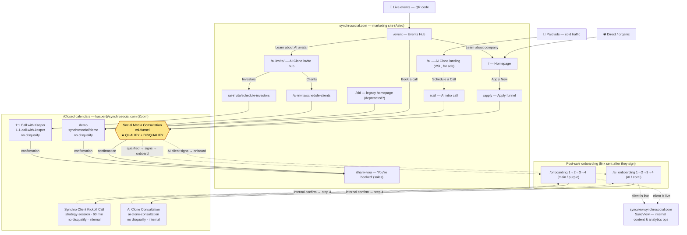

# Synchro Social — Ecosystem & Booking Map

> One place to see how every property, funnel, page, and booking calendar connects —
> so we (and anyone we hand this to) don't get lost. Last updated as part of the
> Calendly → iClosed migration.

## The big picture

## Properties

| Property | URL | What it is |
| --- | --- | --- |
| Marketing site | `synchrosocial.com` | Astro site — all funnels, landing pages, onboarding |
| SyncView | `syncview.synchrosocial.com` | Internal Instagram analytics + content-ops dashboard (the `client-analytics` repo). Used by the team **after** a client is signed; not part of the booking funnels. |

## Entry points → booking calendar

| Entry point | Page | Audience | Calendar | Qualify/disqualify? |
| --- | --- | --- | --- | --- |
| Cold ads | `/ai` → `/call` | Cold prospects | **Social Media Consultation** (`vsl-funnel`) | **YES — the filter** |
| Main site | `/` → `/apply` | Warm-ish prospects | **Social Media Consultation** (`vsl-funnel`) | **YES — the filter** |
| Events Hub "Book a call" | `/event` | Met Kasper at an event | **demo** (`synchrosocial/demo`) | No (warm) |
| AI invite — Clients | `/ai-invite/schedule-clients` | Event AI-clone leads | **demo** (`synchrosocial/demo`) | No (warm) |
| AI invite — Investors | `/ai-invite/schedule-investors` | Investors | **1:1 Call** (`1-1-call-with-kasper`) | No |
| Legacy homepage | `/old` | (deprecated) | **demo** (`synchrosocial/demo`) | No |
| Main onboarding step 3 | `/onboarding_step3` | Signed clients | **Kickoff Call** (`strategy-session`, 60 min) | No |
| AI onboarding step 3 | `/ai_onboarding_step3` | Signed AI clients | **AI Clone Consultation** (`ai-clone-consultation`) | No |

## Calendar confirmation logic

| Calendar | Disqualify | Confirmation page | Why |
| --- | --- | --- | --- |
| Social Media Consultation (`vsl-funnel`) | **On** | → `synchrosocial.com/thank-you` | Cold/main filter; terminal sales booking |
| demo (`synchrosocial/demo`) | Off | → `synchrosocial.com/thank-you` | Warm event/client booking; terminal |
| 1:1 Call (`1-1-call-with-kasper`) | Off | → `synchrosocial.com/thank-you` | Investor booking; terminal |
| Kickoff Call (`strategy-session`) | Off | Internal (→ click to step 4) | Onboarding step, must continue the flow |
| AI Clone Consultation (`ai-clone-consultation`) | Off | Internal (→ click to step 4) | Onboarding step, must continue the flow |

## Why this is coherent

- **One filter, used at both cold doors.** The only calendar with disqualification is *Social Media Consultation*, and it sits on exactly the two pages that receive unqualified traffic: `/apply` (main site) and `/call` (AI ads landing). Everything downstream is already-warm or already-signed, so no filter.
- **Warm doors don't filter.** Event leads (`/ai-invite`, `/event`) and investors get friction-free calendars (`demo`, `1:1`).
- **Onboarding never dumps clients on the sales thank-you page.** The two onboarding-step calendars use iClosed's internal confirmation so the client continues to step 4 ("Final Words"); only sales bookings redirect to `/thank-you`.
- **Two AI surfaces, on purpose:** `/ai` = cold ad landing (filtered), `/ai-invite/` = warm event invite (unfiltered). Same theme, different traffic temperature.

## Open items

- **`/old`** — legacy homepage still in the build. Confirm it's still used; if not, delete rather than migrate.
- Confirmation-page + disqualification settings are configured per event in the **iClosed dashboard** (the API is read-only for event config), not in this repo.
