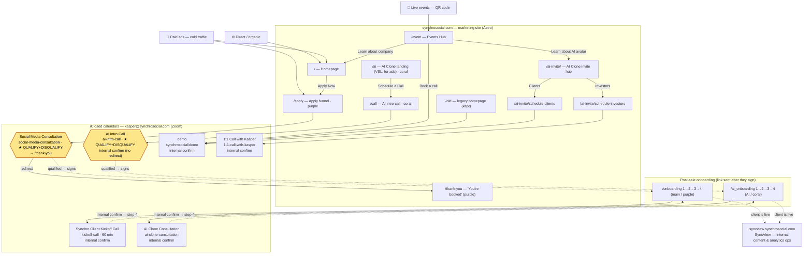

# Synchro Social — Ecosystem & Booking Map

> One place to see how every property, funnel, page, and booking calendar connects —
> so we (and anyone we hand this to) don't get lost. Reflects the completed
> Calendly → iClosed migration. All booking runs on iClosed (`app.iclosed.io`).

## The big picture

## Properties

| Property | URL | What it is |
| --- | --- | --- |
| Marketing site | `synchrosocial.com` | Astro site — all funnels, landing pages, onboarding |
| SyncView | `syncview.synchrosocial.com` | Internal Instagram analytics + content-ops dashboard (the `client-analytics` repo). Used by the team **after** a client signs; not part of booking. |

## Entry points → booking calendar

Current paid Meta plan (2026-07-08): ads run to the main purple funnel,
`/` or `/apply`, using the Social Media Consultation calendar
(`social-media-consultation`). The older `/ai` -> `/call` cold-ad path below is
kept as a site surface, not the current Meta launch target.

| Entry point | Page | Theme | Calendar | Qualifies? | After booking |
| --- | --- | --- | --- | --- | --- |
| Cold ads | `/ai` → `/call` | coral | **AI Intro Call** (`ai-intro-call`) | **YES — filter** | internal (no redirect) |
| Main site | `/` → `/apply` | purple | **Social Media Consultation** (`social-media-consultation`) | **YES — filter** | → `/thank-you` |
| Events Hub "Book a call" | `/event` | — | **demo** (`synchrosocial/demo`) | No | internal |
| AI invite — Clients | `/ai-invite/schedule-clients` | — | **demo** (`synchrosocial/demo`) | No | internal |
| AI invite — Investors | `/ai-invite/schedule-investors` | — | **1:1 Call** (`1-1-call-with-kasper`) | No | internal |
| Legacy homepage | `/old` | — | **demo** (`synchrosocial/demo`) | No | internal |
| Main onboarding step 3 | `/onboarding_step3` | purple | **Kickoff Call** (`kickoff-call`, 60 min) | No | internal → step 4 |
| AI onboarding step 3 | `/ai_onboarding_step3` | coral | **AI Clone Consultation** (`ai-clone-consultation`) | No | internal → step 4 |

## Why this is coherent

- **Two filter calendars, one per cold door.** `/apply` (main, purple) uses *Social Media Consultation*; `/ai`→`/call` (ads, coral) uses *AI Intro Call*. Both qualify + disqualify. They're separate only so each can have the right post-booking behavior.
- **Only `/apply` redirects to `/thank-you`.** That page is purple, so it matches the purple `/apply` funnel. `/call` is coral, so it uses iClosed's internal confirmation instead of jumping to the purple `/thank-you` — preserving the old (Calendly) behavior and the funnel's look.
- **Warm doors don't filter.** Event leads (`/ai-invite`, `/event`) and investors get friction-free calendars (`demo`, `1:1`), all internal confirmation.
- **Onboarding never dumps clients on the sales thank-you page.** Both onboarding calendars use internal confirmation so the client continues to step 4 ("Final Words").
- **Two AI surfaces, on purpose:** `/ai` = cold ad landing (filtered) vs `/ai-invite/` = warm event invite (unfiltered). Same theme, different traffic temperature.

## Notes

- Confirmation-page + disqualification settings are configured per event in the **iClosed dashboard** (the public API is read-only for event config), not in this repo.
- `/old` is a kept legacy homepage; its booking uses `demo` like the other warm entry points.
