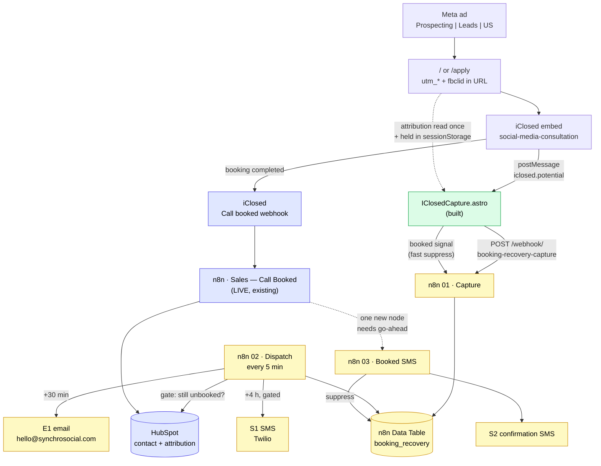

# Booking Recovery — project memory

> **Read this first.** Persistent memory for the booking-recovery and CRM
> automation project: follow up with people who start a booking and never
> finish, confirm the ones who do, and make every ad-sourced lead land in
> HubSpot with its attribution intact.
>
> Sibling docs: `MESSAGE_TEMPLATES.md` (the copy + date logic),
> `HUBSPOT_SCHEMA.md` (CRM model + properties), `TWILIO_RUNBOOK.md` (SMS
> setup, compliance), `n8n/` (importable workflow drafts).
> Wider context: `../meta-ads/README.md`, `../ECOSYSTEM_MAP.md`, and
> `client-analytics/docs/CLIENT_LIFECYCLE_MAP.md`.

**Status 2026-08-14:** site-side capture is built and pushed; n8n workflows are
drafted and importable; nothing is live. Three unblocks needed — see §7.

---

## 1. Why this is worth doing — the live numbers

Read from the Meta dataset `4309835332571875` and ad account
`24069488506082034` on 2026-08-14, covering the 7 days since the
**Prospecting | Leads | US | Aug 2026** campaign went live on Aug 7
($150/day, `OUTCOME_LEADS`, currently ACTIVE):

| | 7-day |
| --- | --- |
| Spend | **$625.95** |
| Impressions / clicks | 5,761 / 180 |
| Landing page views | 139 |
| People who entered contact info in the booking form | **~33** |
| People who completed a booking | **8** |
| **People who gave their name and phone and never booked** | **~25** |

**About 76% of everyone who starts the booking form never finishes it, and
today not one of them is ever contacted again.**

At $18.97 of ad spend per person who starts, that is **~$474 a week paid for
leads that fall on the floor** — three quarters of the budget.

| If recovery converts | Extra bookings/wk | Blended cost per booking |
| --- | --- | --- |
| — (today) | — | $78.24 |
| 10% | +2.5 | $59.61 |
| 20% | +5.0 | $48.15 |
| 30% | +7.5 | $40.38 |

Recovering even one in five would roughly **double booked calls at the same
spend**. That is the business case, and it is why this is worth building
properly rather than quickly.

> **How the ~33 is derived, and its one soft spot.** iClosed's server-side
> `Potential` event fired 66 times. The browser `iclosed_potential` fired 26
> times over the same window, and in every hour where both appear the server
> count is exactly double the browser count (12/6, 8/4, 6/3, 6/3) — consistent
> with the known iClosed quirk of firing once for email and once for phone
> (`meta-ads/README.md` §9.5). So 66 ÷ 2 ≈ 33 distinct people. Bookings (8) come
> from iClosed's `invitee_meeting_scheduled`, which is unambiguous. If the
> doubling assumption is wrong the abandonment rate could be as low as ~52%
> (if 66 were all distinct, minus 8 booked, over 66) — still the majority of
> spend. **The capture system replaces this estimate with an exact count within
> a day of going live**, which is reason enough to ship it even before the
> messaging is switched on.

**Bonus finding:** iClosed's server-side events (`Potential`, `Qualified`,
`invitee_meeting_scheduled`) are arriving in production, not just test mode.
`meta-ads/README.md` §9.1 lists final embedded-flow CAPI proof as an open item —
this data closes it. It also proves iClosed holds the lead's email and phone
**server-side**, which matters for capture route B below.

---

## 2. The one insight the whole design rests on

**There is no "abandoned booking" event, and there never can be.** Someone who
types their name and phone and then closes the tab fires nothing. A closed tab
is not observable.

So abandonment can only be **inferred from absence**:

```
capture the lead the moment we first see them
        ↓
wait
        ↓
did a booking arrive?   no → follow up
                        yes → suppress, silently
```

Everything else follows from this. In particular, the system's correctness
depends far more on the **suppression** path than the sending path, because the
cost of the two errors is wildly asymmetric:

- Miss a recovery → lose a lead that was already lost. Cost: nothing extra.
- Message someone who *did* book → "you didn't book a time" to a person holding
  a confirmed calendar invite. Cost: the call, and the credibility.

Every ambiguous case in this system therefore resolves toward **not sending**.

---

## 3. Architecture



Green = built and pushed. Yellow = drafted, not yet created in n8n.
Blue = already live, untouched.

Three independent suppression signals, deliberately redundant, because §2:

1. **Browser** — `iclosed.call_scheduled` POSTs a `booked` signal instantly.
2. **Server** — the iClosed *Call booked* webhook closes the row (workflow 03).
3. **Gate** — the dispatcher re-checks HubSpot in the seconds before any send,
   and a contact carrying a `deal_id` is never messaged.

Signal 3 alone is sufficient. 1 and 2 exist so the common case never even
reaches the gate.

---

## 4. Capture — how we get the lead's details

The load-bearing question of the project. Four routes, ranked:

### Route A — browser postMessage (BUILT, pending payload proof)

`IClosedCapture.astro` listens for iClosed's `iclosed.potential` /
`iclosed.qualified` postMessage and reads any name/email/phone the payload
carries. **iClosed does not publish these payload shapes**, so the component
scans the object for anything that looks like contact info rather than guessing
field names, and echoes the raw payload to the backend so the patterns can be
tightened from real data.

**This route is unproven until someone runs the diagnostic** (§5). If the
payload turns out to be a bare notification with no PII, Route A captures
nothing and we fall to B or D. The code is written so that outcome is visible
immediately rather than silent.

### Route B — iClosed server-side (most reliable if it exists)

iClosed demonstrably holds the email and phone server-side — it hashes them
into the CAPI `Potential` events now arriving in Meta (§1). So the data exists;
the question is only whether iClosed will hand it over, via an
incomplete-booking webhook, a leads list/export, or an API.

### Route C — form-first (guaranteed, changes the funnel)

Put our own name/email/phone step in front of the iClosed embed and prefill the
calendar. Capture becomes 100% reliable because we own the form. Costs a step
of friction on a funnel that currently converts 33 starters from 139 landing
page views, so it is a deliberate trade, not a default.

### Route D — no capture, retarget only

Fall back to Meta custom audiences off `iclosed_potential`. No email, no SMS,
no CRM record. This is the floor, and it is roughly what exists today.

**Recommendation: ship A, prove it with the diagnostic, and hold C in reserve.**
A is already built and costs the funnel nothing.

---

## 5. The diagnostic — resolving Route A in five minutes

Deployed with the capture component and safe on production (it only writes to
the browser console):

1. Open **`https://synchrosocial.com/apply?ss-debug-iclosed=1`**
2. Open DevTools → Console
3. Enter a phone and name in the booking form and click Continue — **do not
   pick a time**
4. Screenshot the `[ss-capture]` groups

Every raw iClosed postMessage is printed. What the groups show decides it:

| Console shows | Meaning | Do |
| --- | --- | --- |
| payload with name/email/phone | Route A works | set the endpoint, go live |
| `extracted: {}` on every event | payload is bare | switch to Route B or C |
| no `[ss-capture]` lines at all | deploy or origin problem | check the branch is on `main` |

This must run on the deployed site — the capture code is on the branch, not yet
merged, so it has to reach `main` first (§7).

---

## 6. What was built in this session

| Thing | Where | State |
| --- | --- | --- |
| Lead capture + attribution | `src/components/IClosedCapture.astro` | built, builds clean, pushed |
| Wiring into the embed | `src/components/IClosedEmbed.astro` | 2-line additive change |
| Message copy + date logic | `MESSAGE_TEMPLATES.md` | done |
| Date logic test | `n8n/test-date-logic.js` | 16 assertions, all pass |
| CRM model + properties | `HUBSPOT_SCHEMA.md` | done, verified live |
| n8n capture intake | `n8n/01-…json` | importable draft |
| n8n dispatcher | `n8n/02-…json` | importable draft |
| n8n booked-SMS | `n8n/03-…json` | importable draft |
| Twilio setup + compliance | `TWILIO_RUNBOOK.md` | done |

Design choices worth remembering:

- Capture is a **separate component** from the Meta bridge. The bridge is live
  conversion tracking; it was left byte-identical so this cannot regress it.
- Capture is **gated to the acquisition calendars**. The embed is shared with
  the post-sale kickoff calendars, so without the gate a signed client booking
  their kickoff would be chased as a lead — the same trap the pixel bridge fell
  into (`CLIENT_LIFECYCLE_MAP.md` §15.1, still open for the pixel).
- Capture is **inert until configured**. No `PUBLIC_SS_CAPTURE_ENDPOINT`, no
  network calls. Safe to merge before the backend exists.
- Attribution is read **on the landing page**, not at booking, because the ad
  click lands on `/` and the booking happens on `/apply`.

---

## 7. Blocked on — three unblocks, in priority order

| # | Blocker | Who | Unblocks |
| --- | --- | --- | --- |
| 1 | **n8n MCP connector is disabled in this chat** (`enabledInChat: false`) | Sidney | all three workflows. Without it no session can create or edit them; the JSON in `n8n/` has to be imported by hand instead. |
| 2 | **HubSpot MCP is read-only** — every write reports `REQUIRES_REAUTHORIZATION` | Sidney | the 15 properties in `HUBSPOT_SCHEMA.md` §4. Reconnect the connector with CRM write scope. |
| 3 | **No Twilio account** | Sidney | S1 and S2. A2P 10DLC registration is on the critical path — see `TWILIO_RUNBOOK.md`. |

Note that **1 and 2 do not block each other, and neither blocks the email**.
E1 needs only n8n. SMS needs Twilio. CRM attribution needs HubSpot write. They
can proceed in parallel.

---

## 8. Sequencing

**Now — no new accounts, no compliance dependency**

1. `[SIDNEY]` Merge the branch to `main` so capture deploys (inert; no behaviour change).
2. `[SIDNEY]` Run the §5 diagnostic and send the console screenshot. **Everything downstream depends on this answer.**
3. `[SIDNEY]` Enable the n8n connector, and reconnect HubSpot with write scope.
4. `[CLAUDE]` Create the `booking_recovery` Data Table and import workflows 01 + 02, email-only.
5. `[CLAUDE]` Create the 15 HubSpot properties.
6. `[SIDNEY]` Set `PUBLIC_SS_CAPTURE_ENDPOINT` and redeploy → capture goes live.
7. `[BOTH]` Watch one day of capture with sending still off. This converts the ~33/week estimate into an exact count and proves the gate before a single message goes out.
8. `[SIDNEY]` Go-ahead to switch E1 on.

**In parallel — Twilio, because registration is slow**

9. `[SIDNEY]` Create the Twilio account, submit A2P 10DLC brand + campaign.
10. `[SIDNEY]` Add SMS consent language to the iClosed form (§9 risk 2).
11. `[CLAUDE]` Import workflow 03; flip `SMS_ENABLED` once 9 and 10 are both done.
12. `[SIDNEY]` One-node go-ahead on the live booking router to call workflow 03.

**Then**

13. Attribution flows to HubSpot → CAC reporting → close `meta-ads/README.md` §9.3–9.4.

---

## 9. Risks, ranked

1. **Messaging someone who already booked.** The one failure that costs a sale.
   Mitigated by three independent suppression signals (§3) and a gate that
   fails closed — a HubSpot error leaves the lead pending, never sends
   unverified. *Residual: a booking made in the seconds between the gate check
   and the send. Unavoidable, vanishingly rare, low harm.*

2. **TCPA exposure on S1.** The iClosed form's only consent line today is
   "you consent to your data being saved in accordance with our Terms & Privacy
   Policy". That is consent to **store data**, not to **receive marketing
   texts**. S1 — an unsolicited text to someone who did not complete a booking —
   is the exposed message. **Do not enable S1 until the form carries explicit
   SMS consent language.** E1 (email) and S2 (transactional confirmation) are
   not blocked by this. `SMS_ENABLED` ships `false` for exactly this reason.

3. **Route A may capture nothing.** iClosed's payload is undocumented and may
   be bare. Cheap to find out (§5), and B/C are real fallbacks — but this is the
   single largest unknown in the plan.

4. **Single Gmail credential.** E1 adds load to the one "Hello email"
   credential every client email already depends on; a password change silently
   killed sales email for ~2 days in July (`CLIENT_LIFECYCLE_MAP.md` §15.16).
   Mitigation is the existing one: set the Error Workflow on every new workflow
   so failures DM Sidney within seconds.

5. **Touching the live booking router.** Workflow 03 needs one Execute Workflow
   node added to production sales automation. Additive, but `CLAUDE.md` requires
   explicit go-ahead and it should be done with a snapshot taken first, per the
   `n8n-backups/` convention.

6. **Chasing disqualified leads.** iClosed disqualified 4 people this week.
   They failed the qualification filter deliberately and must not be recovered.
   Handled — `iclosed.disqualified` captures as `stage=disqualified`, which
   suppresses on arrival.

7. **Double-messaging across sessions.** One person who abandons three times is
   one lead. Handled by keying rows on normalised email/E.164 phone rather than
   session.

---

## 10. Open decisions for Sidney

Short answers change the build; none block starting.

1. **Timing** — E1 at 30 min and S1 at 4 h after that. Too fast, too slow, or right?
2. **One touch or a sequence?** You gave one email template. Most recovery value
   is in touch 2 and 3 (e.g. +1 day, +3 days). Want them written?
3. **S1 wording** — you gave no unfinished-booking SMS template; the one in
   `MESSAGE_TEMPLATES.md` is E1 compressed in your voice. Approve or rewrite.
4. **Route C** — if the diagnostic shows iClosed's payload is bare, are you
   willing to put our own name/phone step in front of the calendar? It
   guarantees capture at the cost of one step of friction.
5. **Reply handling** — S2 invites "please text me". Who watches that number,
   and should inbound texts land in Slack?
6. **`closedwon`/`closedlost` still lie** (`HUBSPOT_SCHEMA.md` §1). Worth fixing
   properly while we are in the CRM, or leave it?

---

## 11. Session log

- **2026-08-14 — project kickoff.** Audited the live stack: confirmed the five
  custom HubSpot properties exist, read the real deal pipeline (found it has
  drifted from `CLIENT_LIFECYCLE_MAP.md` — two genuine terminal stages now
  exist), confirmed HubSpot MCP is read-only and the n8n connector is disabled.
  Pulled the live Meta numbers and sized the opportunity at ~25 lost leads and
  ~$474 of spend per week. Confirmed the ad account now has a payment method and
  that iClosed server-side CAPI is live in production — both open items in
  `meta-ads/README.md`. Built the capture component + attribution, gated to
  acquisition calendars, inert until configured. Wrote the copy deck and found
  both source templates had date bugs; built and tested the date logic (16
  assertions). Drafted three importable n8n workflows in house style. Nothing
  live; three unblocks outstanding (§7).

---

*Update this doc when a §7 blocker clears, a route in §4 is proven or ruled
out, or the copy changes. Keep §1 honest — re-read the numbers before quoting
them.*
