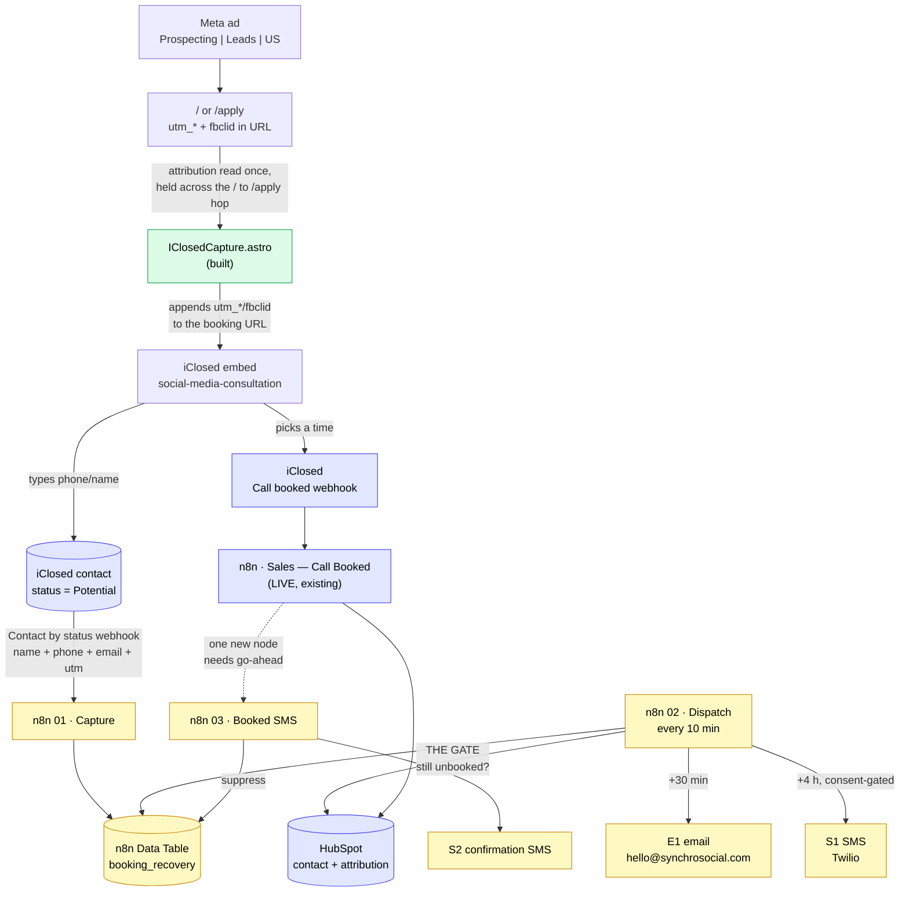

# Booking Recovery — project memory

> **Read this first.** Persistent memory for the booking-recovery and CRM
> automation project: follow up with people who start a booking and never
> finish, confirm the ones who do, and make every ad-sourced lead land in
> HubSpot with its attribution intact.
>
> Sibling docs: `MESSAGE_TEMPLATES.md` (the copy + date logic),
> `HUBSPOT_SCHEMA.md` (CRM model + properties), `TWILIO_RUNBOOK.md` (SMS
> setup, compliance), `n8n/` (importable workflow drafts).
> Wider context: `../meta-ads/README.md`, `../ECOSYSTEM_MAP.md`, and
> `client-analytics/docs/CLIENT_LIFECYCLE_MAP.md`.

**Status 2026-08-14 — LIVE.** Both halves are active in n8n. Capture records
abandoned bookings; the dispatcher emails them 30 minutes later, capped at 5
sends per run, after re-checking HubSpot. Switched on by Sidney after an
adversarial test pass found and fixed three critical send-path defects. Remaining: point iClosed
at it (§7.1 — the only thing standing between this and real data), then the
dispatcher, then Twilio. Capture runs on iClosed's **server-side webhook**, not
on browser events — §4 explains why that distinction decides the whole design.

### As built

| Thing | Identifier |
| --- | --- |
| n8n Data Table | `booking_recovery` · `xEhLpKwNv8uTaeAK` |
| n8n workflow | *Sales — Booking Recovery Capture (iClosed)* · `31DnMJLU3YM89py1` · **published** |
| Webhook path | `POST /webhook/iclosed-lead-abandoned?secret=…` |

Proven by three test executions against the live Data Table
(`382793`, `382821`, `382822`):

- a phone-only Potential lead is stored with the phone normalised to E.164, the
  name title-cased, and the ad campaign attached — `follow_up_due_at` exactly
  30 minutes out;
- **a repeat delivery of the same lead routes to `touch`, not `arm`** — the
  original clock and the first-touch attribution both survive, which is the
  behaviour that stops one person being emailed three times;
- a lead arriving with a call attached lands `suppressed / booked` with the
  clock cleared.

Nothing in this workflow can send a message. It has no Gmail node, no Twilio
node, and no HubSpot node.

**Auth, and a bug caught by smoke-testing the live URL.** A bad secret
originally *threw*, and n8n answers a thrown workflow with **HTTP 200 and an
empty body**. Nothing was written — the throw happened before any Data Table
node — so it was safe. But it meant a webhook whose URL got truncated on paste
would sit in iClosed reporting success forever while capturing nothing. That is
the same silent-failure shape that took sales email down for two days in July
(`CLIENT_LIFECYCLE_MAP.md` §15.16), so it was fixed rather than documented:
unauthorized now returns a real **401** via an `Authorized?` branch. Verified
against the production URL — a correct secret returns `200 {"ok":true}`, and
both a wrong secret and a deliberately truncated `?se` return
`401 {"ok":false,"error":"unauthorized"}`.

The workflow's Error Workflow is set to *SyncView — Error Alerts → DM Sidney*
(`itqDXSl2ybsRSAiQ`), per house convention.

**Six webhooks, one per status.** iClosed refuses two webhooks with the same
URL and allows only one status each, so each carries a distinct `&src=` tag.
The workflow ignores unknown query params, and now records the tag — which
means the real Potential → Qualified → Booked drop-off gets measured per stage
instead of inferred from Meta event counts.

---

## 1. Why this is worth doing — the live numbers

Read from the Meta dataset `4309835332571875` and ad account
`24069488506082034` on 2026-08-14, covering the 7 days since the
**Prospecting | Leads | US | Aug 2026** campaign went live on Aug 7
($150/day, `OUTCOME_LEADS`, currently ACTIVE):

| | 7-day |
| --- | --- |
| Spend | **$625.95** |
| Impressions / clicks | 5,761 / 180 |
| Landing page views | 139 |
| People who entered contact info in the booking form | **~33** |
| People who completed a booking | **8** |
| **People who gave their name and phone and never booked** | **~25** |

**About 76% of everyone who starts the booking form never finishes it, and
today not one of them is ever contacted again.**

At $18.97 of ad spend per person who starts, that is **~$474 a week paid for
leads that fall on the floor** — three quarters of the budget.

| If recovery converts | Extra bookings/wk | Blended cost per booking |
| --- | --- | --- |
| — (today) | — | $78.24 |
| 10% | +2.5 | $59.61 |
| 20% | +5.0 | $48.15 |
| 30% | +7.5 | $40.38 |

Recovering even one in five would roughly **double booked calls at the same
spend**. That is the business case, and it is why this is worth building
properly rather than quickly.

> **How the ~33 is derived, and its one soft spot.** iClosed's server-side
> `Potential` event fired 66 times. The browser `iclosed_potential` fired 26
> times over the same window, and in every hour where both appear the server
> count is exactly double the browser count (12/6, 8/4, 6/3, 6/3) — consistent
> with the known iClosed quirk of firing once for email and once for phone
> (`meta-ads/README.md` §9.5). So 66 ÷ 2 ≈ 33 distinct people. Bookings (8) come
> from iClosed's `invitee_meeting_scheduled`, which is unambiguous. If the
> doubling assumption is wrong the abandonment rate could be as low as ~52%
> (if 66 were all distinct, minus 8 booked, over 66) — still the majority of
> spend. **The capture system replaces this estimate with an exact count within
> a day of going live**, which is reason enough to ship it even before the
> messaging is switched on.

> ⚠️ **The email-only system will not reach all ~25.** The `/apply` form asks
> for **phone first**, then first and last name, then Continue. Someone who
> types a phone number and leaves has no email on record — and email is the
> only channel available until Twilio clears. **How much of the ~25 is
> phone-only is currently unknown**, and it is the single biggest unknown in
> the value estimate: if most abandoners never reach the email field, E1 alone
> addresses a minority of them and SMS stops being a nice-to-have.
>
> The capture-only observation period (§8 step 5) answers this exactly, before
> any message is sent and before any money goes to Twilio. Do not skip it, and
> do not quote the full ~25 as the email-recoverable number until it has run.
> The dispatcher already handles both shapes: leads with an email get E1 then
> S1; phone-only leads get S1 as their first touch.

**Bonus finding:** iClosed's server-side events (`Potential`, `Qualified`,
`invitee_meeting_scheduled`) are arriving in production, not just test mode.
`meta-ads/README.md` §9.1 lists final embedded-flow CAPI proof as an open item —
this data closes it. It also proves iClosed holds the lead's email and phone
**server-side**, which matters for capture route B below.

---

## 2. The one insight the whole design rests on

**There is no "abandoned booking" event, and there never can be.** Someone who
types their name and phone and then closes the tab fires nothing. A closed tab
is not observable.

So abandonment can only be **inferred from absence**:

```
capture the lead the moment we first see them
        ↓
wait
        ↓
did a booking arrive?   no → follow up
                        yes → suppress, silently
```

Everything else follows from this. In particular, the system's correctness
depends far more on the **suppression** path than the sending path, because the
cost of the two errors is wildly asymmetric:

- Miss a recovery → lose a lead that was already lost. Cost: nothing extra.
- Message someone who *did* book → "you didn't book a time" to a person holding
  a confirmed calendar invite. Cost: the call, and the credibility.

Every ambiguous case in this system therefore resolves toward **not sending**.

---

## 3. Architecture



Green = built and pushed. Yellow = drafted, not yet created in n8n.
Blue = already live, untouched.

Three independent suppression signals, deliberately redundant, because §2:

1. **At capture** — a contact arriving with a call already attached
   (`latestCall`) is filed suppressed and never armed.
2. **On booking** — the iClosed *Call booked* webhook closes the row
   (workflow 03).
3. **The gate** — the dispatcher re-checks HubSpot in the seconds before any
   send; a contact carrying a `deal_id` is never messaged, and a CRM error
   leaves the lead pending rather than sending unverified.

Signal 3 alone is sufficient. 1 and 2 exist so the common case never reaches it.
This matters because iClosed's status webhook has **no delay of its own** —
someone who types a phone number and books forty seconds later still fires an
"abandoned" event, so the wait window and the gate are what make the difference
between a recovery system and an embarrassment.

---

## 4. Capture — how we get the lead's details

The load-bearing question of the project, and the one that changed mid-session.

### ❌ Browser postMessage — ruled out, definitively

The obvious idea is to read the lead's details out of the `iclosed.potential`
postMessage the booking iframe sends to our page. **This cannot work.** The
payload carries exactly one field. iClosed's own Google Tag Manager guide gives
the canonical listener:

```js
window.addEventListener("message", ({ data }) => {
  const event = data?.type;
  switch (event) {
    case "iclosed.potential":   /* … */ break;
    case "iclosed.qualified":   /* … */ break;
    case "iclosed.disqualified":/* … */ break;
    case "iclosed.call_scheduled": /* … */ break;
  }
});
```

`data.type`, and nothing else — no name, no email, no phone, not even a contact
id, although the iframe holds all of them internally. No browser-side code can
recover PII that was never sent. *(Verified against
[docs.iclosed.io](https://docs.iclosed.io/en/articles/10420617-google-tag-manager);
an earlier version of this project built a payload scanner on the assumption
the payload might be richer. It was replaced.)*

### ✅ Route B — iClosed's server-side webhook (chosen)

iClosed creates a **real contact record the moment someone types a phone
number**, stamps it `Potential`, and will push that whole record to a webhook.
The abandoned booking is a first-class object in iClosed; we simply never asked
for it.

Confirmed webhook events (`developer.iclosed.io/docs/webhooks/introduction`):

| Event | Use |
| --- | --- |
| **Contact by status** | ← the abandonment trigger |
| New contact created | safety net |
| Contact updated | — |
| Call booked / cancelled / rescheduled | already wired to n8n today |
| Call outcome added | — |

This account already delivers iClosed webhooks into n8n (`Call booked`,
`Call cancelled`), so the transport is proven. Independent corroboration that
iClosed holds this data server-side: its CAPI `Potential` events arrive in Meta
with hashed user data (§1) — it cannot hash an email it does not have.

Four things this route demands, all handled in workflow `01`:

1. **No delay of its own.** "Contact by status" fires the instant the status
   changes, so someone who types a phone and books 40 seconds later still
   triggers it. The wait window and the pre-send gate supply the delay.
2. **No signature.** iClosed lists HMAC-SHA256 as roadmap, not shipped, so the
   endpoint would otherwise be an open PII write. Authenticated with a shared
   secret.
3. **Guaranteed duplicates.** `Potential` fires twice when the form takes both
   phone and email, and retries redeliver. Upsert on the iClosed contact id.
4. **Unverified payload shape.** The event list is documented; a field-level
   schema is not. The normalizer reads several plausible shapes and stores the
   raw body, so the first real delivery settles it without a second guess.

### 🔗 The join — why there is still browser code

The webhook says *who*. It cannot say *which ad*, because the ad click lands on
our page and the contact is created inside an iframe on another origin — click
ids and cookies do not cross that boundary. Attribution and identity end up in
different halves of the system.

`IClosedCapture.astro` closes the gap by handing the attribution to iClosed at
embed time: it reads `utm_*`/`fbclid` on the landing page, holds them in
`sessionStorage` across the `/` → `/apply` hop, and appends them to the booking
URL before iClosed's `widget.js` boots. iClosed stores them on the contact and
returns them in the webhook — so the two halves arrive already joined. Same
mechanism as the existing `?test-pixel=true` passthrough.

### 🚫 The one postMessage that *does* carry PII — and why we decline it

For the record, so nobody rediscovers it and thinks it is the answer: on the
**disqualification redirect** path iClosed posts
`{type:"openInParentTab", url:"…?iclosedEmail=&iclosedPhone=&iclosedName="}`
to the parent window. That genuinely carries contact details.

Do not build on it. It fires only for leads iClosed **disqualified** — the one
cohort that must never be chased, because they were filtered out on purpose. It
is also inert today (the calendar's disqualification redirect URL is empty), so
using it would mean switching on a redirect purely to harvest data from people
we have just told we cannot help them. Wrong on both counts.

### Route C — form-first (held in reserve)

Our own name/phone step in front of the embed. Capture becomes ours end to end
and consent becomes trivially collectable on our page rather than in someone
else's iframe. Costs a step of friction. **Worth reaching for if either the
webhook payload disappoints or iClosed cannot host the SMS consent checkbox**
(`TWILIO_RUNBOOK.md` §4) — those are the two things that would make owning the
form worth the conversion cost.

---

## 5. The diagnostic

`?ss-debug-iclosed=1` is still shipped, with a narrower job now that capture is
server-side. Open
**`https://synchrosocial.com/apply?ss-debug-iclosed=1`** with DevTools:

- confirms the attribution passthrough actually decorated the booking URL —
  the one thing that must work for ad attribution to survive the iframe;
- echoes each postMessage and states whether anything beyond `type` appeared,
  so if iClosed ever enriches these payloads we find out rather than assume.

The far more important test is the **first real webhook delivery**, which is
what pins the payload field names.

---

## 6. What was built in this session

| Thing | Where | State |
| --- | --- | --- |
| Attribution passthrough + diagnostic | `src/components/IClosedCapture.astro` | built, builds clean, pushed |
| Wiring into the embed | `src/components/IClosedEmbed.astro` | additive; renders before `widget.js` |
| Message copy + date logic | `MESSAGE_TEMPLATES.md` | done |
| Date logic test | `n8n/test-date-logic.js` | 16 assertions, all pass |
| CRM model + properties | `HUBSPOT_SCHEMA.md` | done, verified live |
| n8n iClosed webhook intake | `n8n/01-…json` | importable draft |
| n8n dispatcher | `n8n/02-…json` | importable draft |
| n8n booked-SMS | `n8n/03-…json` | importable draft |
| n8n reconciliation sweep + backfill | `n8n/04-…json` | importable draft; needs an iClosed API key |
| Twilio setup + compliance | `TWILIO_RUNBOOK.md` | done |

Design choices worth remembering:

- The browser component is **separate** from the Meta pixel bridge. That bridge
  is live conversion tracking; it was left byte-identical so none of this can
  regress it.
- It renders **before `widget.js`**, because it has to rewrite `data-url`
  before iClosed reads it.
- It makes **no network calls at all**. The pivot to a server-side webhook
  removed the browser→n8n POST, and with it the CORS surface, the client-side
  PII handling, and the build-time endpoint variable.
- Attribution is read **on the landing page**, not at the embed, because the ad
  click lands on `/` and the booking happens on `/apply`.
- The n8n side is **gated and idempotent**: upsert on the iClosed contact id,
  because `Potential` fires twice per lead and webhooks retry.

**Course correction during the session.** The first version of the browser
component scanned the postMessage payload for name/email/phone and POSTed it to
a capture endpoint. It was written defensively because iClosed does not publish
the payload shape — and the shape turned out to be a single `type` field, so
that design could never have captured anything. It was replaced with the
server-side webhook route (§4) once the docs were read properly. Two useful
consequences: the architecture is simpler than the original, and the calendar
gating that version needed is now redundant, because iClosed's webhook is
registered per calendar rather than per page.

---

## 7. Blocked on — three unblocks, in priority order

| # | Blocker | Who | Unblocks |
| --- | --- | --- | --- |
| ~~0~~ | ~~n8n MCP connector disabled~~ | — | **CLEARED 2026-08-14.** Data Table and capture workflow built, tested and published. |
| **1** | **The iClosed "Contact by status" webhook is not pointed at us** | Sidney | **everything.** The workflow is live and waiting; until iClosed is told to call it, zero leads are captured. iClosed → Settings → Developer → Webhooks → **Create Webhook**, event **Contact by status**, URL `https://synchrosocial.app.n8n.cloud/webhook/iclosed-lead-abandoned?secret=<the secret in the Authenticate + Normalize node>`. Add **New contact created** at the same URL as a safety net. *(Plan-tier question resolved: the dashboard shows both Webhooks and API Keys, and two webhooks already run.)* |
| 2 | **HubSpot connector is still read-only** — writes report `REQUIRES_REAUTHORIZATION` | Sidney | the 3 properties in `HUBSPOT_SCHEMA.md` §4, and the dispatcher's CRM gate. The permission change did not take: it needs a full **disconnect and reconnect** of the HubSpot connector, not a toggle. Note it can create *records* but never *property definitions* — those need the HubSpot UI or a private app token. |
| 3 | **No iClosed API key** | Sidney | workflow 04, the sweep that backfills every abandoned lead already sitting in the account. Settings → Developer → API Keys (shown once). |
| 4 | **No Twilio account** | Sidney | S1 and S2 only. Neither the email nor the capture depends on it. |

None of these block each other. E1 needs 1 + 2. Attribution needs 3. SMS needs
4. **The email path is the shortest and delivers most of the value** — it needs
no new vendor, no compliance change, and no upgrade.

---

## 8. Sequencing

**Now — no new accounts, no compliance dependency**

1. `[SIDNEY]` Enable the n8n connector in this chat; reconnect HubSpot with write scope.
2. `[SIDNEY]` Check iClosed → Settings → Developer. Confirm **Webhooks** and **API Keys** are present on the current plan, and say which triggers the UI offers.
3. `[CLAUDE]` Create the `booking_recovery` Data Table; import workflow 01 with a shared secret.
4. `[SIDNEY]` Point iClosed's **Contact by status** webhook at it, for the `social-media-consultation` calendar.
5. `[BOTH]` **Capture only, sending off.** Watch one real delivery to pin the payload field names, then a day of traffic. This replaces the ~33/week estimate with an exact count and proves the suppression path before any message exists.
6. `[CLAUDE]` Import workflow 02, `SMS_ENABLED=false`; create the 3 HubSpot properties.
7. `[BOTH]` Run the gate test (`TWILIO_RUNBOOK.md` §7 step 4) — a lead who booked must produce **no** send.
8. `[SIDNEY]` Merge the branch to `main` so attribution passthrough deploys (inert otherwise; no behaviour change).
9. `[SIDNEY]` Go-ahead to switch E1 on.

**In parallel — Twilio, because registration is slow and runs on someone else's clock**

10. `[SIDNEY]` Check first whether **iClosed has native SMS reminders**. If it does, S2 ships on iClosed's already-registered sender with no Twilio work at all — most of the SMS value for none of the effort.
11. `[SIDNEY]` Otherwise: create the Twilio account, submit A2P 10DLC brand + campaign. **The EIN must be at least 15 days old.**
12. `[SIDNEY]` Add SMS consent language to the iClosed form — and confirm iClosed even supports a custom consent checkbox. If it does not, that is the trigger for Route C (§4).
13. `[CLAUDE]` Import workflow 03; flip `SMS_ENABLED` only once 11 and 12 are both done.
14. `[SIDNEY]` One-node go-ahead on the live booking router to call workflow 03.
15. `[SIDNEY]` Decide where inbound texts land — S2 says "please text me", so someone has to be reading.

**Then**

16. Attribution flows through to HubSpot → CAC reporting → closes `meta-ads/README.md` §9.3–9.4.

---

## 9. Risks, ranked

1. **Messaging someone who already booked.** The one failure that costs a sale.
   Mitigated by three independent suppression signals (§3) and a gate that
   fails closed — a HubSpot error leaves the lead pending, never sends
   unverified. *Residual: a booking made in the seconds between the gate check
   and the send. Unavoidable, vanishingly rare, low harm.*

2. **TCPA exposure on S1.** The iClosed form's only consent line today is
   "you consent to your data being saved in accordance with our Terms & Privacy
   Policy". That is consent to **store data**, not to **receive marketing
   texts**. S1 — an unsolicited text to someone who did not complete a booking —
   is the exposed message. **Do not enable S1 until the form carries explicit
   SMS consent language.** E1 (email) and S2 (transactional confirmation) are
   not blocked by this. `SMS_ENABLED` ships `false` for exactly this reason.

3. **The webhook payload shape is unverified.** iClosed documents the event
   list but not a field schema. Workflow 01 reads several plausible shapes and
   stores the raw body, so the first delivery settles it — but until one
   arrives, the field names are inference. Step 5 of §8 exists for this.

3b. **The webhook endpoint is unauthenticated by the provider.** iClosed has no
   HMAC signing (roadmap, not shipped), so a shared secret is the only thing
   between the open internet and a PII write. It must be long and random, and
   it must never appear in a committed file.

4. **Single Gmail credential.** E1 adds load to the one "Hello email"
   credential every client email already depends on; a password change silently
   killed sales email for ~2 days in July (`CLIENT_LIFECYCLE_MAP.md` §15.16).
   Mitigation is the existing one: set the Error Workflow on every new workflow
   so failures DM Sidney within seconds.

5. **Touching the live booking router.** Workflow 03 needs one Execute Workflow
   node added to production sales automation. Additive, but `CLAUDE.md` requires
   explicit go-ahead and it should be done with a snapshot taken first, per the
   `n8n-backups/` convention.

6. **Chasing disqualified leads.** iClosed disqualified 4 people this week.
   They failed the qualification filter deliberately and must not be recovered.
   Handled — `iclosed.disqualified` captures as `stage=disqualified`, which
   suppresses on arrival.

7. **Double-messaging across sessions.** One person who abandons three times is
   one lead. Handled by keying rows on normalised email/E.164 phone rather than
   session.

---

## 10. Open decisions for Sidney

Short answers change the build; none block starting.

1. **Timing** — E1 at 30 min and S1 at 4 h after that. Too fast, too slow, or right?
2. **One touch or a sequence?** You gave one email template. Most recovery value
   is in touch 2 and 3 (e.g. +1 day, +3 days). Want them written?
3. **S1 wording** — you gave no unfinished-booking SMS template; the one in
   `MESSAGE_TEMPLATES.md` is E1 compressed in your voice. Approve or rewrite.
4. **Route C** — if the diagnostic shows iClosed's payload is bare, are you
   willing to put our own name/phone step in front of the calendar? It
   guarantees capture at the cost of one step of friction.
5. **Reply handling** — S2 invites "please text me". Who watches that number,
   and should inbound texts land in Slack?
6. **HubSpot is booking your wins as losses.** `closedwon`/`closedlost` are
   HubSpot's *won/lost stage types*, so today a signed contract counts as won
   revenue before any invoice is paid, and a client entering onboarding counts
   as **Closed Lost**. Correctly-named stages already exist and are empty — the
   migration was started and abandoned. Fix it now, or leave it? Nothing here
   depends on the answer (we key on stage ids), but every funnel number you
   read does. Details in `HUBSPOT_SCHEMA.md` §1.

7. **The back catalogue.** Workflow 04 backfills every abandoned lead already
   sitting in iClosed — a pool nobody has counted. It files them as
   `backfilled`, not `pending`, so **nothing is sent** until you say so.
   Once you have seen the number: leave it as a dataset, or promote some slice
   of it (last 30 days? last 7?) into the recovery flow? Emailing months of
   cold leads in one batch is a deliverability risk as well as a taste
   question, so this should be a deliberate choice, not a switch that flips
   itself.

8. **Cancelled calls are excluded — deliberately, and maybe wrongly.** A lead
   who booked and then cancelled keeps their `deal_id`, so the gate suppresses
   them forever. And because cancellations never move the deal off
   `appointmentscheduled` (`CLIENT_LIFECYCLE_MAP.md` §15.13), they sit in the
   pipeline looking like live bookings. They are arguably your *best*
   re-engagement cohort — they wanted a call. Want a separate flow for them?
   It is a different message and a different system, so it is not folded in
   here.

9. **Should a confirmed abandoner get a deal?** Current design says no — a
   contact only, so "deals in the pipeline" keeps meaning "calls booked". The
   alternative is a deal at a new *Booking Abandoned* stage, which makes
   abandonment visible in the pipeline at the cost of filling your one free-tier
   pipeline with records you cannot bulk-clean (no workflows on free). Which do
   you want to look at every morning?

---

## 11. Session log

- **2026-08-14 — project kickoff.** Audited the live stack: confirmed the five
  custom HubSpot properties exist, read the real deal pipeline (found the
  won/lost data-integrity bug in §10.6), confirmed HubSpot MCP is read-only and
  the n8n connector is disabled. Pulled the live Meta numbers and sized the
  opportunity at ~25 lost leads and ~$474 of spend per week. Confirmed the ad
  account now has a payment method and that iClosed server-side CAPI is live in
  production — both open items in `meta-ads/README.md`. Wrote the copy deck;
  both source templates had date bugs, so the date logic was built and tested
  (16 assertions). Drafted three importable n8n workflows in house style.

  **Mid-session correction.** Capture was first built browser-side, scanning
  iClosed's postMessage for contact details. Reading iClosed's GTM
  documentation showed the payload is `{type}` and nothing else, so that route
  can never work. Rebuilt around iClosed's server-side **Contact by status**
  webhook, which delivers the whole contact record; the browser component was
  reduced to attribution passthrough, which is the piece the webhook genuinely
  cannot supply. Also corrected a second wrong assumption: HubSpot free allows
  10 custom properties **account-wide**, not per object, so a 15-property plan
  became 3 JSON-blob properties.

  Nothing live; four unblocks outstanding (§7).

---

*Update this doc when a §7 blocker clears, a route in §4 is proven or ruled
out, or the copy changes. Keep §1 honest — re-read the numbers before quoting
them.*
