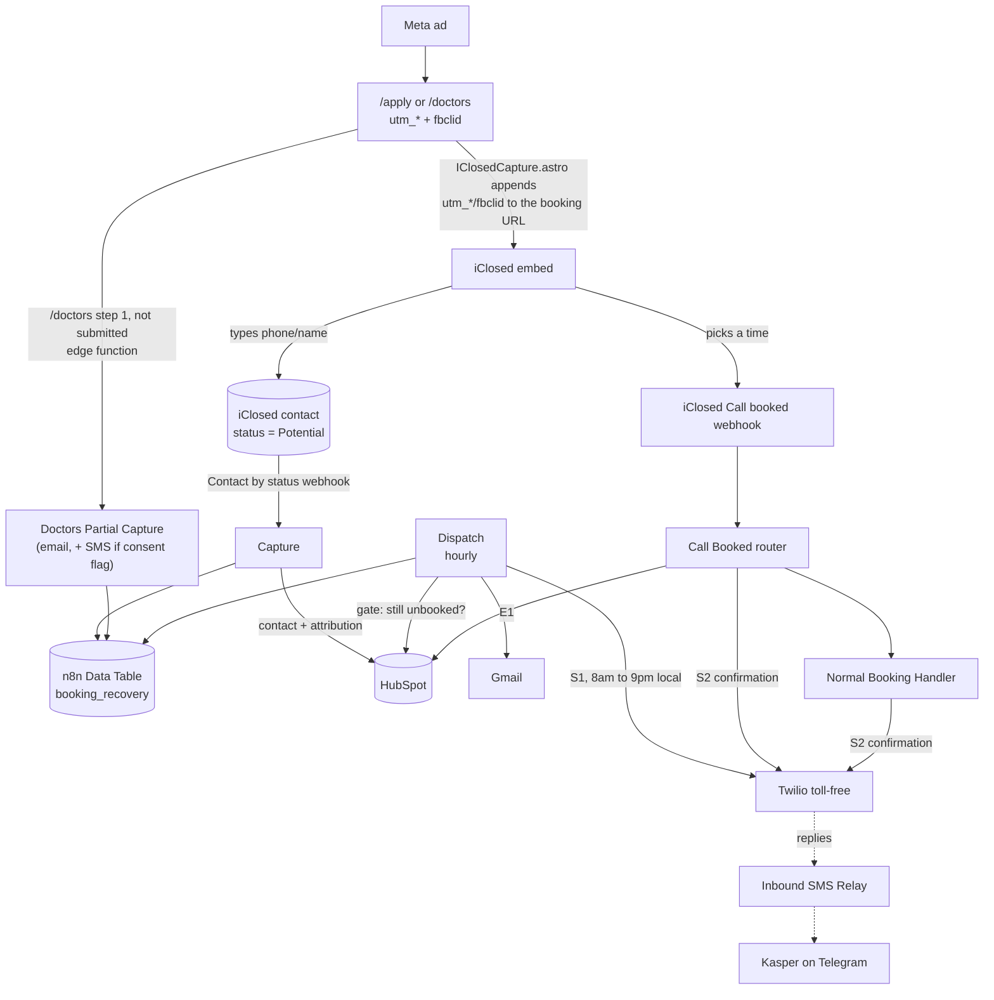

# Booking Recovery — project memory

> **Read this first.** Persistent memory for the booking-recovery and CRM
> automation project: follow up with people who start a booking and never
> finish, confirm the ones who do, and make every ad-sourced lead land in
> HubSpot with its attribution intact.
>
> Sibling docs: `MESSAGE_TEMPLATES.md` (the copy, timing and date logic),
> `HUBSPOT_SCHEMA.md` (CRM model and properties), `TWILIO_RUNBOOK.md` (SMS sender,
> compliance and the open consent questions), `n8n/test-date-logic.js` (date helper
> tests). Wider context: `../meta-ads/README.md`, `../ECOSYSTEM_MAP.md`, and
> `client-analytics/docs/CLIENT_LIFECYCLE_MAP.md`.
>
> **n8n is the source of truth.** This folder describes the live workflows; it
> does not contain them. The four old importable workflow drafts
> (`01-…` to `04-…`) were **obsolete and have been deleted** (2026-09-30). Only
> `n8n/test-date-logic.js` remains. To see what is really wired, open the
> workflow in n8n, not this file.

**Status 2026-09-30: LIVE, email and text.** Capture records abandoned bookings.
About 30 minutes later the dispatcher, which runs hourly, sends the recovery
**email and the recovery text** in the same run, after re-checking our own table
and HubSpot so nobody who booked is chased. The text waits for 8am to 9pm in the
lead's own timezone; the email does not. Booked leads get a confirmation text from
the booking workflows. Replies to texts are relayed to Kasper on Telegram. A daily
heartbeat DMs Sidney and raises alarms.

Since 2026-09-30 a second intake exists: `/doctors` visitors who fill step 1 but
do not submit are armed for email, and for a text too when the page sent `sms_consent=yes` (the step-1 form shows the SMS consent line under the phone field since 2026-10-01).

The recovery text is live without an SMS consent check. That is an open owner
decision, written up in `TWILIO_RUNBOOK.md` §3. Read it before changing anything
about texting.

### As built

| Workflow | n8n id | What it does |
| --- | --- | --- |
| `Sales — Booking Recovery Capture (iClosed)` | `31DnMJLU3YM89py1` | Receives iClosed "Contact by status" webhooks. Arms abandoned leads, suppresses booked and disqualified ones, mirrors every acquisition-calendar lead to HubSpot. No send nodes. |
| `Sales — Booking Recovery Dispatch` | `nQ4vnZ8bmG3E3Lor` | Hourly. Picks due rows, runs the booked checks, sends E1 (Gmail) and S1 (Twilio), stamps the row, mirrors to HubSpot, alerts Sidney (Slack) and Kasper (Telegram). |
| `Sales — Doctors Partial Lead Capture` | `8nq6jGbpmCDZxnQz` | Receives a `/doctors` step-1 lead from the `doctors-partial-capture` edge function. Arms an email row, plus a text when `sms_consent=yes` is sent. |
| `Sales — Call Booked (iClosed)` | `xoPqojySDriQ8Mzh` | Existing booking router. AI funnel confirmation email and text; hands the normal and doctors funnels on. |
| `Normal Sales — Booking Handler` | `ghpbQQJizAnR6p2b` | Normal and doctors funnel confirmation email, nurture and confirmation text. |
| `Sales — Inbound SMS Relay` | `m6T2atZGGXKlDqfw` | Twilio inbound webhook to Kasper on Telegram. |
| `Sales — Booking Recovery Heartbeat` | `a2sJJ3oZMefASPl2` | Daily 9am ET Slack digest plus four alarms (§11). |

Shared pieces: n8n Data Table `booking_recovery` (`xEhLpKwNv8uTaeAK`); error
workflow *SyncView — Error Alerts → DM Sidney* (`itqDXSl2ybsRSAiQ`), set on every
workflow above.

Webhook paths (all under `https://synchrosocial.app.n8n.cloud/webhook/`):
`iclosed-lead-abandoned`, `doctors-partial-capture` (both need `?secret=`, which
lives in the workflow's `Authenticate + Normalize` node and **must never be
committed**), `iclosed-call-booked`, `twilio-inbound-sms` (no auth).

**Verified against** (read from n8n on 2026-09-30, UTC):

| Workflow | Version | Last saved |
| --- | --- | --- |
| Capture | `6210da40` | 2026-09-30 21:17 |
| Dispatch | `ca93c4bf` | 2026-09-30 22:00 |
| Doctors Partial Lead Capture | `9f4d6a8b` | 2026-09-30 21:30 |
| Call Booked (iClosed) | `078c0ce4` | 2026-09-30 21:17 |
| Normal Sales — Booking Handler | `4b7d65f6` | 2026-08-27 |
| Inbound SMS Relay | `78ebaf58` | 2026-08-27 |
| Heartbeat | `d5310994` | 2026-09-30 22:00 |

If a workflow's saved time is later than the one above, this folder may be stale
for that workflow. Re-read it and update the doc in the same change.

### How it works, end to end

1. **Capture.** iClosed posts a contact the moment someone types a phone number.
   Capture normalises it (E.164 phone, cleaned name, UTMs, Meta click id, the
   lead's qualification answers) and decides: armed (`pending`, due in 30
   minutes), or `suppressed` with a reason (`booked`, `disqualified`,
   `other_calendar`). Only acquisition calendars are chased:
   `social-media-consultation`, `ai-intro-call`, `doctor-strategy-call`.
2. **Dispatch**, hourly. For each pending row: closes it out if the lead opted
   out, already booked, went stale, or is over 72 hours old; otherwise, if due,
   decides which channels are needed (email if there is an address and none sent;
   text if there is a phone and none sent and it is inside 8am to 9pm local).
3. **The gate.** HubSpot is searched by email and phone. A `deal_id`,
   `iclosed_status = booked`, or `customer`/`opportunity` lifecycle suppresses the
   lead. A HubSpot error stops the whole run.
4. **Send.** The row is stamped sent **before** the message goes out, so a failure
   costs a missed message, never a duplicate. Then the HubSpot mirror and alerts.
5. **Replies.** Email replies go to `kasper@synchrosocial.com`; text replies go to
   Kasper's Telegram via the inbound relay.

Copy and timing detail: `MESSAGE_TEMPLATES.md`. Data columns are in the Data
Table itself; the ones that matter are `lead_key`, `email`, `phone`, `status`
(`pending`, `completed`, `suppressed`), `suppressed_reason`, `follow_up_due_at`,
`email_sent_at`, `sms_sent_at`, `do_not_contact`, `calendar`, `created_at`.

---

## 1. Why this is worth doing — the live numbers

Read from the Meta dataset `4309835332571875` and ad account
`24069488506082034` on 2026-08-14, covering the 7 days since the
**Prospecting | Leads | US | Aug 2026** campaign went live on Aug 7
($150/day, `OUTCOME_LEADS`, currently ACTIVE):

| | 7-day |
| --- | --- |
| Spend | **$625.95** |
| Impressions / clicks | 5,761 / 180 |
| Landing page views | 139 |
| People who entered contact info in the booking form | **~33** |
| People who completed a booking | **8** |
| **People who gave their name and phone and never booked** | **~25** |

**About 76% of everyone who starts the booking form never finishes it, and
today not one of them is ever contacted again.**

At $18.97 of ad spend per person who starts, that is **~$474 a week paid for
leads that fall on the floor** — three quarters of the budget.

| If recovery converts | Extra bookings/wk | Blended cost per booking |
| --- | --- | --- |
| — (today) | — | $78.24 |
| 10% | +2.5 | $59.61 |
| 20% | +5.0 | $48.15 |
| 30% | +7.5 | $40.38 |

Recovering even one in five would roughly **double booked calls at the same
spend**. That is the business case, and it is why this is worth building
properly rather than quickly.

> **How the ~33 is derived, and its one soft spot.** iClosed's server-side
> `Potential` event fired 66 times. The browser `iclosed_potential` fired 26
> times over the same window, and in every hour where both appear the server
> count is exactly double the browser count (12/6, 8/4, 6/3, 6/3) — consistent
> with the known iClosed quirk of firing once for email and once for phone
> (`meta-ads/README.md` §9.5). So 66 ÷ 2 ≈ 33 distinct people. Bookings (8) come
> from iClosed's `invitee_meeting_scheduled`, which is unambiguous. If the
> doubling assumption is wrong the abandonment rate could be as low as ~52%
> (if 66 were all distinct, minus 8 booked, over 66) — still the majority of
> spend. **The capture system replaces this estimate with an exact count within
> a day of going live**, which is reason enough to ship it even before the
> messaging is switched on.

> ⚠️ **Phone-only abandoners.** The `/apply` form asks for **phone first**, then
> first and last name, then Continue. Someone who types a phone number and leaves
> has no email on record. **How much of the ~25 is phone-only is still unmeasured
> in this doc**, and it is the reason the text channel exists: a phone-only lead
> gets the recovery text as their only touch, and a lead with both gets the email
> and the text. The daily heartbeat (§11) reports how many captured leads were
> phone-only, so the number can be read off instead of argued about.

**Bonus finding:** iClosed's server-side events (`Potential`, `Qualified`,
`invitee_meeting_scheduled`) are arriving in production, not just test mode.
`meta-ads/README.md` §9.1 lists final embedded-flow CAPI proof as an open item —
this data closes it. It also proves iClosed holds the lead's email and phone
**server-side**, which matters for capture route B below.

---

## 2. The one insight the whole design rests on

**There is no "abandoned booking" event, and there never can be.** Someone who
types their name and phone and then closes the tab fires nothing. A closed tab
is not observable.

So abandonment can only be **inferred from absence**:

```
capture the lead the moment we first see them
        ↓
wait
        ↓
did a booking arrive?   no → follow up
                        yes → suppress, silently
```

Everything else follows from this. In particular, the system's correctness
depends far more on the **suppression** path than the sending path, because the
cost of the two errors is wildly asymmetric:

- Miss a recovery → lose a lead that was already lost. Cost: nothing extra.
- Message someone who *did* book → "you didn't book a time" to a person holding
  a confirmed calendar invite. Cost: the call, and the credibility.

Every ambiguous case in this system therefore resolves toward **not sending**.

---

## 3. Architecture


```mermaid
flowchart TD
  AD["Meta ad"] --> LP["/apply or /doctors<br/>utm_* + fbclid"]
  LP -->|"IClosedCapture.astro appends<br/>utm_*/fbclid to the booking URL"| EMBED["iClosed embed"]

  EMBED -->|"types phone/name"| ICP[("iClosed contact<br/>status = Potential")]
  ICP -->|"Contact by status webhook"| CAP["Capture"]
  CAP --> DT[("n8n Data Table<br/>booking_recovery")]
  CAP -->|"contact + attribution"| HS[("HubSpot")]

  LP -->|"/doctors step 1, not submitted<br/>edge function"| DOC["Doctors Partial Capture<br/>(email, + SMS if consent flag)"]
  DOC --> DT

  DISP["Dispatch<br/>hourly"] --> DT
  DISP -->|"gate: still unbooked?"| HS
  DISP -->|"E1"| EMAIL["Gmail"]
  DISP -->|"S1, 8am to 9pm local"| SMS["Twilio toll-free"]

  EMBED -->|"picks a time"| IC["iClosed Call booked webhook"]
  IC --> ROUTER["Call Booked router"]
  ROUTER --> HS
  ROUTER -->|"S2 confirmation"| SMS
  ROUTER --> NORMAL["Normal Booking Handler"]
  NORMAL -->|"S2 confirmation"| SMS
  SMS -.->|"replies"| RELAY["Inbound SMS Relay"] -.-> TG["Kasper on Telegram"]
```

Five independent suppression layers, deliberately redundant, because of §2:

1. **At capture.** A contact arriving with a call already attached, marked
   disqualified, or on a non-acquisition calendar is filed suppressed and never
   armed.
2. **On booking.** The booking's own status webhook reaches Capture, which resolves
   the lead to the existing row and stamps it `suppressed / booked`.
3. **At send, our own table.** Dispatch drops any pending lead matching a row
   marked `booked` in the last 30 days, by email or by the last 9 phone digits.
4. **At send, HubSpot.** The gate described above. It fails closed.
5. **Opt-out.** `do_not_contact` on the row closes it across every channel.

Layers 3 and 4 are each sufficient alone. 1 and 2 exist so the common case never
reaches them. This matters because iClosed's status webhook has **no delay of its
own**: someone who types a phone number and books forty seconds later still fires
an "abandoned" event, so the wait window and the gate are what separate a
recovery system from an embarrassment.

### One lead, one row

`lead_key` is `phone || email || iClosed contact id`, so a lead's key can change as
iClosed learns more about them. Capture therefore looks up the existing row by
`lead_key` OR email OR phone (with `__no_match__` placeholders so a blank field
never matches every blank row) and writes to the row it finds. On 2026-09-04 a
lead was emailed 29 minutes after booking because his booking arrived under a
different key and created a second row while the first kept its timer. The heartbeat
now alarms on both symptoms (§11).

### Re-arming

A lead is armed once per **episode**, not once forever. A closed row (`completed`
or `suppressed`) is re-armed for a new episode when the person returns more than
**30 days** after we last contacted them (or after the row was created, if we
never did). Test leads (`utm_source` containing "test") re-arm a closed row
immediately. A row that is still `pending` is never re-armed. Missing or
unparseable timestamps fail closed, so a malformed row can never license a chase.

---

## 4. Capture — how we get the lead's details

The load-bearing question of the project, and the one that changed mid-session.

### ❌ Browser postMessage — ruled out, definitively

The obvious idea is to read the lead's details out of the `iclosed.potential`
postMessage the booking iframe sends to our page. **This cannot work.** The
payload carries exactly one field. iClosed's own Google Tag Manager guide gives
the canonical listener:

```js
window.addEventListener("message", ({ data }) => {
  const event = data?.type;
  switch (event) {
    case "iclosed.potential":   /* … */ break;
    case "iclosed.qualified":   /* … */ break;
    case "iclosed.disqualified":/* … */ break;
    case "iclosed.call_scheduled": /* … */ break;
  }
});
```

`data.type`, and nothing else — no name, no email, no phone, not even a contact
id, although the iframe holds all of them internally. No browser-side code can
recover PII that was never sent. *(Verified against
[docs.iclosed.io](https://docs.iclosed.io/en/articles/10420617-google-tag-manager);
an earlier version of this project built a payload scanner on the assumption
the payload might be richer. It was replaced.)*

### ✅ Route B — iClosed's server-side webhook (chosen)

iClosed creates a **real contact record the moment someone types a phone
number**, stamps it `Potential`, and will push that whole record to a webhook.
The abandoned booking is a first-class object in iClosed; we simply never asked
for it.

Confirmed webhook events (`developer.iclosed.io/docs/webhooks/introduction`):

| Event | Use |
| --- | --- |
| **Contact by status** | ← the abandonment trigger |
| New contact created | safety net |
| Contact updated | — |
| Call booked / cancelled / rescheduled | already wired to n8n today |
| Call outcome added | — |

This account already delivers iClosed webhooks into n8n (`Call booked`,
`Call cancelled`), so the transport is proven. Independent corroboration that
iClosed holds this data server-side: its CAPI `Potential` events arrive in Meta
with hashed user data (§1) — it cannot hash an email it does not have.

Four things this route demands, all handled in workflow `01`:

1. **No delay of its own.** "Contact by status" fires the instant the status
   changes, so someone who types a phone and books 40 seconds later still
   triggers it. The wait window and the pre-send gate supply the delay.
2. **No signature.** iClosed lists HMAC-SHA256 as roadmap, not shipped, so the
   endpoint would otherwise be an open PII write. Authenticated with a shared
   secret.
3. **Guaranteed duplicates.** `Potential` fires twice when the form takes both
   phone and email, and retries redeliver. Rows are keyed phone first, and every
   event is resolved to one row by `lead_key` OR email OR phone (see Re-arming).
4. **Payload shape.** The field-level schema is not documented by iClosed. It was
   unverified at first; the normalizer is now mapped to real deliveries
   (executions `382967` and `382968`). The raw body is still stored, truncated to
   4,000 characters, in the row's `raw` column.

### 🔗 The join — why there is still browser code

The webhook says *who*. It cannot say *which ad*, because the ad click lands on
our page and the contact is created inside an iframe on another origin — click
ids and cookies do not cross that boundary. Attribution and identity end up in
different halves of the system.

`IClosedCapture.astro` closes the gap by handing the attribution to iClosed at
embed time: it reads `utm_*`/`fbclid` on the landing page, holds them in
`sessionStorage` across the `/` → `/apply` hop, and appends them to the booking
URL before iClosed's `widget.js` boots. iClosed stores them on the contact and
returns them in the webhook — so the two halves arrive already joined. Same
mechanism as the existing `?test-pixel=true` passthrough.

### 🚫 The one postMessage that *does* carry PII — and why we decline it

For the record, so nobody rediscovers it and thinks it is the answer: on the
**disqualification redirect** path iClosed posts
`{type:"openInParentTab", url:"…?iclosedEmail=&iclosedPhone=&iclosedName="}`
to the parent window. That genuinely carries contact details.

Do not build on it. It fires only for leads iClosed **disqualified** — the one
cohort that must never be chased, because they were filtered out on purpose. It
is also inert today (the calendar's disqualification redirect URL is empty), so
using it would mean switching on a redirect purely to harvest data from people
we have just told we cannot help them. Wrong on both counts.

### Route C — form-first (held in reserve, partly used)

Our own name/phone step in front of the embed. Capture becomes ours end to end
and consent becomes trivially collectable on our page rather than in someone
else's iframe. Costs a step of friction. The webhook payload turned out to be
enough, so this was not needed for `/apply`. It **is** how the `/doctors` flow
works: that page has its own step-1 form, and a visitor who fills it but does not
submit is sent to `Sales — Doctors Partial Lead Capture` (email recovery only,
never a text). Worth reaching for on `/apply` if the consent question in
`TWILIO_RUNBOOK.md` §3 is resolved by owning the form.

---

## 5. The diagnostic

`?ss-debug-iclosed=1` is still shipped, with a narrower job now that capture is
server-side. Open
**`https://synchrosocial.com/apply?ss-debug-iclosed=1`** with DevTools:

- confirms the attribution passthrough actually decorated the booking URL —
  the one thing that must work for ad attribution to survive the iframe;
- echoes each postMessage and states whether anything beyond `type` appeared,
  so if iClosed ever enriches these payloads we find out rather than assume.

The far more important test is the **first real webhook delivery**, which is
what pins the payload field names.

---

## 6. What exists in this folder and the site

| Thing | Where | Note |
| --- | --- | --- |
| Attribution passthrough + diagnostic | `src/components/IClosedCapture.astro` | rewrites the booking URL with `utm_*`/`fbclid` before the widget boots |
| Wiring into the embed | `src/components/IClosedEmbed.astro` | additive; renders before `widget.js` |
| Message copy + date logic | `MESSAGE_TEMPLATES.md` | describes the live copy |
| Date helper tests | `n8n/test-date-logic.js` | copied from the live nodes; re-copy after changing them |
| CRM model + properties | `HUBSPOT_SCHEMA.md` | §1 and §2 not rechecked since 2026-08-14 |
| Twilio state + consent questions | `TWILIO_RUNBOOK.md` | |
| Public SMS opt-in documentation | `src/pages/sms-opt-in.astro` | see the mismatch in `TWILIO_RUNBOOK.md` §3 |

Design choices worth remembering:

- The browser component is **separate** from the Meta pixel bridge. That bridge is
  live conversion tracking; it was left untouched so none of this can regress it.
- It renders **before `widget.js`**, because it has to rewrite `data-url` before
  iClosed reads it.
- It makes **no network calls at all**. Capture is server to server.
- Attribution is read **on the landing page**, not at the embed, because the ad
  click lands on `/` and the booking happens on `/apply`.
- Capture is **idempotent**: one row per lead, rewritten rather than duplicated,
  because `Potential` fires twice per lead and webhooks retry.

---

## 7. Open items

| # | Item | Who | Note |
| --- | --- | --- | --- |
| 1 | **SMS consent and the public opt-in page** | Sidney | The recovery text does not check consent, and `/sms-opt-in` says no marketing texts are sent. `TWILIO_RUNBOOK.md` §3. |
| 2 | **Toll-free number verification, Advanced Opt-Out, balance** | Sidney | Live in the Twilio console; not checked from this repo. |
| 3 | **Doctors partial capture: source not in any repo** | Sidney | The `doctors-partial-capture` edge function and the `/doctors` code that calls it are not in `synchrosocial` or `client-analytics` as of 2026-09-30. Commit them, or this intake cannot be reviewed or rebuilt. |
| 4 | ~~Heartbeat false-alarms on doctors partial leads~~ **FIXED 2026-09-30** | done | Alarm 3 now ignores rows whose `sms_sent_at` starts with `n/a`. |
| 5 | ~~Slack wording for doctors partial leads~~ **FIXED 2026-09-30** | done | The "Recovery email sent" DM now says "not sent, no text consent (email-only lead)" for those rows. |
| 6 | **Stale notes inside n8n** | whoever owns n8n | Dispatch's `Every Hour` node note and code comments still say "10 min" and "144 runs a day". It runs hourly (24 a day). Cosmetic. |
| 7 | **Dispatch gating** | planned | `client-analytics/docs/plans/2026-09-30-n8n-exit-phase-2.md` step C plans to run Dispatch only when a row is due, behind a replay test that proves every due message still sends. Update this doc when that lands. |
| 8 | **Doctors partial lead to HubSpot** | Sidney | A doctors partial lead has no HubSpot contact until Dispatch creates one when it sends the email. Fine for the gate (no contact means not booked), worth knowing if you look for them in HubSpot sooner. |

Nothing above blocks the email path.

---

## 8. Risks, ranked

1. **Messaging someone who already booked.** The one failure that costs a sale.
   Mitigated by the five layers in §3, a gate that fails closed, and a heartbeat
   alarm that names anyone contacted after booking. *Residual: a booking made in the
   seconds between the gate check and the send. Unavoidable, rare, low harm.*
2. **Text consent (TCPA).** The recovery text is a solicitation to someone who did
   not book and is sent with no stored consent. `TWILIO_RUNBOOK.md` §3. The
   doctors partial flow avoids this by design.
3. **Webhook endpoints are unauthenticated by the provider.** iClosed has no HMAC
   signing (roadmap, not shipped), so a shared secret in the URL is the only
   thing between the open internet and a PII write. It must be long and random and
   must never appear in a committed file. The secrets currently sit in n8n code
   nodes (`CLIENT_LIFECYCLE_MAP.md` §15.6 is the known pile of those); prefer n8n
   credentials when those workflows are next edited. A bad secret returns a real
   **401**, not n8n's default silent HTTP 200.
4. **Single Gmail credential.** E1 adds load to the one "Hello email" credential
   every client email depends on; a password change silently killed sales email
   for about 2 days in July (`CLIENT_LIFECYCLE_MAP.md` §15.16). Every workflow
   here has the error workflow set so failures DM Sidney within seconds.
5. **Touching the live booking routers.** `Sales — Call Booked (iClosed)` and
   `Normal Sales — Booking Handler` are production sales automation. Do not edit
   them without Sidney's go-ahead in that same request, and snapshot first per the
   `n8n-backups/` convention.
6. **Chasing disqualified leads.** Handled: `disqualified` status suppresses on
   arrival and wins over a stale `latestCall` on the same contact.
7. **Double messaging.** Handled: one human, one row (§3), and the heartbeat
   alarms if an identity splits.

---

## 9. Open decisions for Sidney

1. **One touch or a sequence?** Today there is one email and one text per
   episode. Most recovery value in other funnels sits in touches 2 and 3 (for
   example +1 day, +3 days). Want them written?
2. **HubSpot is booking your wins as losses.** `closedwon`/`closedlost` are
   HubSpot's won/lost stage types, so a signed contract counts as won revenue before
   an invoice is paid, and a client entering onboarding counts as **Closed Lost**.
   Correctly named stages exist and were empty when last read (2026-08-14; not
   rechecked). Nothing here depends on the answer (we key on stage ids), but every
   funnel number you read does. Details in `HUBSPOT_SCHEMA.md` §1.
3. **The back catalogue.** A sweep that backfilled every abandoned lead already in
   iClosed was designed and **never built**. Those people also gave only the old
   consent wording, so they are not textable; emailing months of cold leads in one
   batch is a deliverability risk too. Decide deliberately, not by flipping a
   switch.
4. **Cancelled calls are excluded, deliberately, and maybe wrongly.** A lead who
   booked and then cancelled keeps their `deal_id`, so the gate suppresses them
   forever, and cancellations never move the deal off `appointmentscheduled`
   (`CLIENT_LIFECYCLE_MAP.md` §15.13). They are arguably the best re-engagement
   cohort. It would be a different message and a different flow.
5. **Should a confirmed abandoner get a deal?** The design says no: a contact only,
   so "deals in the pipeline" keeps meaning "calls booked". The alternative is a
   deal at a new *Booking Abandoned* stage, at the cost of filling your one
   free-tier pipeline with records you cannot bulk-clean.

---

## 10. History

- **2026-08-14. Kickoff.** Audited the stack, sized the opportunity (§1), and
  rebuilt capture around iClosed's server-side webhook after reading their docs
  showed the browser postMessage carries only `{type}` (§4). Capture and the
  dispatcher went live; the dispatcher was switched on after an adversarial test
  pass found and fixed three critical send-path defects.
- **2026-08-20.** HubSpot mirror widened from abandoned leads to every
  acquisition-calendar lead (booked, disqualified, abandoned). A client kickoff
  call was briefly mirrored as a sales booking and fixed by keying on
  `is_acquisition`, not on `suppressed_reason`.
- **2026-08-26.** Inbound SMS relay created, so replies stop vanishing.
- **2026-08-31.** `disqualified` given precedence over a stale `latestCall`.
- **2026-09-04.** Both channels for every lead; duplicate-row fix after a lead was
  emailed 29 minutes after booking; our own `booked` rows became the first line of
  defence; 30 day re-arm; the heartbeat's four invariant alarms.
- **2026-09-30.** `/doctors` partial capture (email only) and the `/doctors` link in
  the doctors recovery email added. This folder rewritten to match the live
  workflows; the old Twilio setup log retired, and the four old workflow drafts
  deleted.

---

## 11. Monitoring: the heartbeat

**`Sales — Booking Recovery Heartbeat`** (`a2sJJ3oZMefASPl2`, active) DMs Sidney via
*SyncView Bot* every day at 09:00 America/New_York with the last 24 hours:
abandoned bookings captured, recovery emails sent, recovery texts sent, how many
are still waiting, and a breakdown by outcome.

It exists because of the failure mode this project keeps running into. If capture
silently breaks (iClosed renames a field, a webhook is disabled, the secret stops
matching) the symptom is **zero abandoned leads**, which looks like a quiet week.
The same shape has bitten twice before (the July Gmail revocation, silent for two
days; the June model-retirement incident that motivated the error workflow).

It fails loud in both directions:

- a day with **zero captures** sends a 🚨 message with the three things to check;
- if the digest **stops arriving at all**, that is itself the alarm.

Four **invariant alarms** are prepended when they fire:

1. a lead was **contacted after booking** (the cardinal sin). Only contacts in the
   last 24 hours alarm; older ones are counted quietly;
2. one identity is **split across several rows**, where any row was created in the
   last 24 hours (the duplicate-row bug returning);
3. a row was **closed without the text it was owed** despite having a phone. This
   covers every closed row emailed since 2026-09-04 17:00 UTC, with no 24 hour
   window, so a single miss alarms every morning until fixed. See open item 4 for a
   known false positive on doctors partial leads;
4. a pending row is **overdue by more than 45 minutes** (the sender may be down).
   Dispatch runs hourly, so a row that falls due just after a run can be almost an
   hour late, and a text deliberately held overnight for a lead's quiet hours is
   also a pending, overdue row. Expect this alarm to fire occasionally without
   anything being broken.

---

## 12. Where the ad attribution lands

| Place | Status |
| --- | --- |
| iClosed contact record (`tracking` block) | iClosed stores it; `_fbc` arrives as the Meta click id |
| n8n Data Table `booking_recovery` | populated on every captured lead |
| **HubSpot contact: `ad_attribution`, `booking_recovery`, `iclosed_status`** | written for every acquisition-calendar lead that has an **email**: abandoned, booked and disqualified |

Merging the site branch is what started `utm_*` flowing at all; without it only
`_fbc` is captured, which matches a click in Meta but carries no readable campaign
name.

**What it deliberately does not write:**

- **No `lifecyclestage`.** An existing customer refilling the form must not be
  downgraded. HubSpot sets `lead` itself on creation.
- **No lead status.** Same reasoning: never overwrite sales-owned fields.
- **No deal.** The pipeline's first stage is *Call Scheduled*, and these people did
  not schedule. Deals stay the booking routers' job.

It fails soft: capture is the critical path, and a HubSpot outage must never cost
the lead record. **Phone-only leads are skipped** for HubSpot, because contacts are
keyed on email; they stay in the Data Table until a later event supplies one.

---

*Update this doc when a workflow changes, an open item clears, a route in §4 is
proven or ruled out, or the copy changes. Keep §1 honest: re-read the numbers
before quoting them.*
